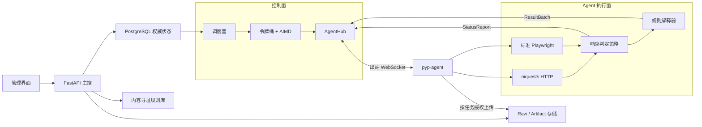
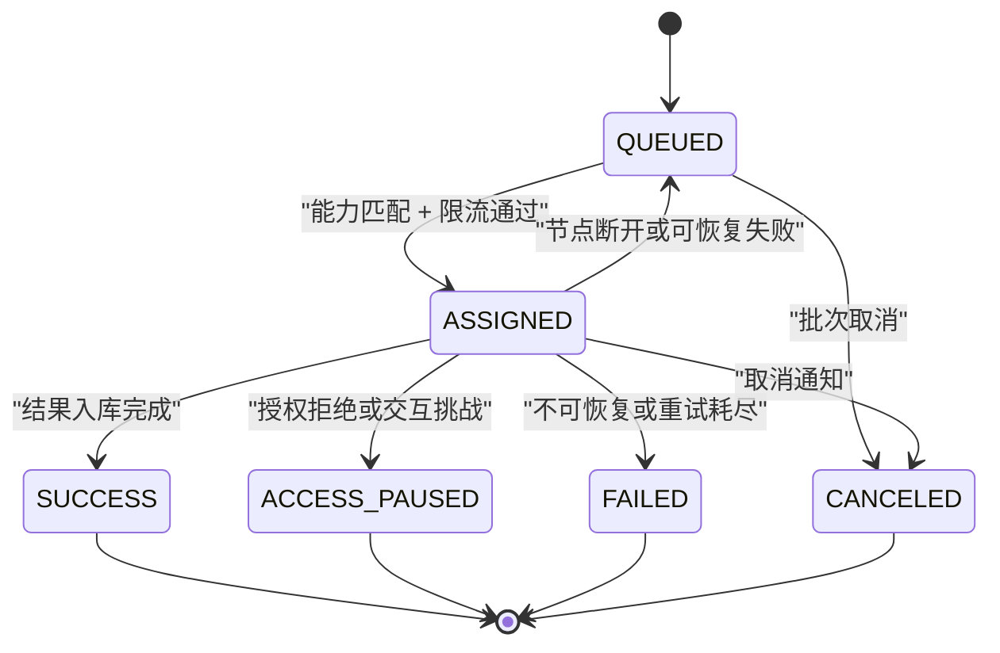
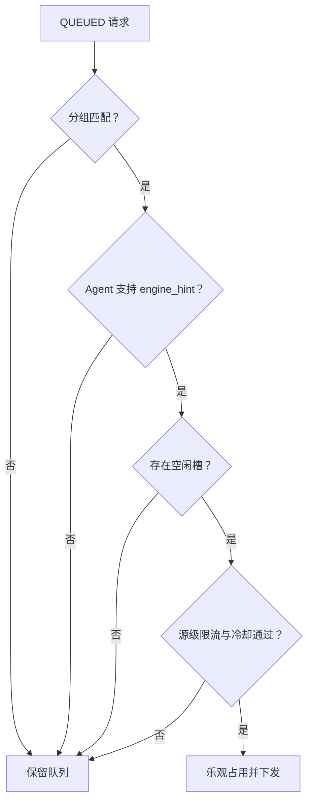

# 01 · 数据获取与 Agent

状态：**运行架构已落地，采集韧性闭环已实现**（2026-07-11）

数据获取系统的价值，不在于把一次请求发出去，而在于长期、稳定、可解释地把外部数据变成可信的数据资产。
一次成功的下载并不困难；困难的是当节点掉线、页面结构变化、目标端限流、授权会话过期、响应变慢或脚本失控时，
系统仍然知道发生了什么，能够停止在正确的位置，并在条件恢复后从正确的位置继续。

payipa 因此把采集设计成一条受控流水线，而不是一组彼此独立的爬虫脚本。主控掌握授权、调度和持久状态，
Agent 负责执行单次下载与解析，规则以内容寻址方式分发，大对象与控制消息分离，所有恢复动作都由明确状态驱动。
本章描述这条流水线的现行实现、边界与后续演进方向。

---

## 1. 架构原则

### 1.1 主控拥有决定权，Agent 只拥有执行权

主控是任务状态、访问依据、速率上限、规则版本和结果入库的唯一权威。Agent 不保存平台数据库凭证，
不维护独立任务队列，也不自行决定更换账号、会话或网络出口。它接收一个有边界的 `TaskSpec`，完成一次请求，
再把结构化结果或结构化故障报告交回主控。

这种划分带来三个直接结果：

1. Agent 可以部署在 NAT、办公网、云主机或 Docker 网络之后，只需主动出站连接主控。
2. 节点损坏或被替换时，权威状态仍在 PostgreSQL，租约到期后可以重新派发。
3. 访问边界不会被某个站点脚本改写；脚本不能通过“多试几个身份”改变平台已经确认的权限范围。

### 1.2 控制面与数据面分离

WebSocket 只承载注册、心跳、任务、取消、状态和结果指针等小消息。HTML、图片、视频和其他大对象不经过
WebSocket；需要保留原文时，由任务显式携带 `archive_raw=true`，成功响应才进入工件上传流程。
认证失败、授权拒绝和交互式挑战页不会被归档，避免把拒绝页面误当成业务数据。

### 1.3 PG 是权威状态，内存结构只是加速层

AgentHub、令牌桶和在线连接表属于进程内运行态；请求状态、租约、`not_before`、源级冷却和人工暂停属于
持久状态。服务重启会丢失瞬时令牌数，却不会丢失“这个请求何时才能再试”或“这个数据源是否需要人工复核”。

### 1.4 自动恢复与访问边界是两套机制

网络抖动、`429` 和暂时性 `5xx` 属于容量与可用性问题，可以退避、冷却和有限重试。`401`、`403`、`451`
以及交互式访问挑战属于身份、授权或政策问题，只能暂停并转人工复核。两类信号不能混用：把授权拒绝当成普通
网络错误会制造无效请求，把短暂 `503` 当成人工事故又会降低可用性。

### 1.5 能力匹配先于负载均衡

Agent 注册时上报支持的引擎。调度器先按任务分组和 `engine_hint` 过滤节点，再在候选节点中按空闲槽与权重选择。
Browser 任务不会落到只支持 HTTP 的节点；没有匹配节点时，任务留在队列中，而不是错误降级成另一种执行方式。

### 1.6 不以绕过访问控制作为可靠性手段

payipa 的高可靠采集建立在授权记录、标准协议、明确速率和可审计会话之上。系统不破解验证码，不伪造设备身份，
不通过轮换身份或出口规避封禁，也不在被拒绝后继续自动尝试。真正可靠的系统必须能把“暂时不可用”和“不可继续”
区分开来，而不是把所有阻力都视为需要突破的障碍。

---

## 2. 总体架构



系统可以分为四个平面：

| 平面 | 主要职责 | 权威数据 |
|---|---|---|
| 管理面 | 建源、访问复核、规则配置、运行观察 | 用户操作与审计日志 |
| 控制面 | 定时触发、优先级、能力匹配、限流、租约、取消 | PostgreSQL 请求与批次状态 |
| 执行面 | HTTP/Browser 获取、响应分类、解析、发现链接 | 当前任务内的临时状态 |
| 数据面 | 结构化结果入库、raw 与多媒体工件保存 | 数据库记录与永久对象键 |

Agent 主动建立 WebSocket，因此主控不需要知道节点的 IP 或开放节点入站端口。连接断开后，主控立即回收该节点的
在途请求；租约回收器是第二道兜底。两条路径都只重排仍属于运行批次、仍具有有效访问确认的数据源。

---

## 3. 任务与状态

### 3.1 两层任务模型

用户看到的是“站点任务”，调度器处理的是“请求任务”。一个批次代表站点任务的一次完整执行轮；列表页发现的新链接
通过 `ResultBatch.discovered` 回到主控，经 URL 指纹去重后作为同批次的新请求入队。Agent 不持有跨请求本地队列，
因此广度优先、深度限制、取消和进度统计始终由主控统一控制。

`TaskSpec` 中与执行可靠性直接相关的字段包括：

| 字段 | 作用 |
|---|---|
| `req_id` / `batch_id` | 请求与批次的全链路关联键 |
| `source` / `target` | 数据源和本次目标 |
| `rule_ptr` | `(rule_id, version, content_hash)`，保证执行可复现 |
| `engine_hint` | `http` 或 `browser`，用于能力匹配 |
| `timeout_s` | 单请求硬超时 |
| `group` | 节点分组亲和 |
| `account` | 授权账号维度的预留标识，不承载明文凭证 |
| `archive_raw` | 是否保存成功响应原文 |

### 3.2 请求状态机



可恢复失败重新进入 `QUEUED` 时会同时写入：

- `attempt`：已消耗的尝试次数；
- `not_before`：请求最早可再次派发的时间；
- `error_code`、`reason_code`、`response_status`：机器可聚合的失败语义；
- `error_detail`：经过截断的人工可读摘要；
- `retry_after_s`：本次实际采用的等待秒数。

`not_before` 是请求级闸门，`sources.cooldown_until` 是数据源级闸门。调度查询和最终乐观占用都会再次检查两者，
避免“扫描时尚未冷却、真正占用时已经进入冷却”的竞态。

---

## 4. 采集引擎

### 4.1 HTTP 引擎

常规网页和 API 使用 `niquests`。引擎保持 TLS 校验，遵循部署环境的固定网络配置，并把响应状态、正文、
Content-Type 和规范化后的响应头交给统一响应策略。网络层异常被归一为两类：

- `FetchTimeout`：连接或读取超过任务时限；
- `FetchNetworkError`：DNS、连接、TLS、连接重置等没有有效 HTTP 响应的故障。

异常文本不携带目标 URL、请求头或响应正文，减少日志中泄露查询参数和凭证的风险。

### 4.2 Browser 引擎

动态渲染或已授权的正常页面交互使用标准 Playwright。Browser 是可选能力，只有安装了浏览器运行时的 Agent 才会
在注册帧中上报 `browser`。当前实现按任务启动隔离浏览器上下文，以 `domcontentloaded` 为默认完成条件，返回渲染后
HTML、最终 URL、HTTP 状态和响应头。

Browser 引擎不是规避模式。它不注入隐身脚本，不修改设备指纹，不自动处理验证码，也不在挑战发生后切换身份。
需要登录的数据源应使用经过批准的账号和会话配置；会话保险库、短期凭证下发和浏览器上下文池属于后续增强，
在这些能力完成前，复杂登录流程应由专用 Agent 与人工维护的授权环境承载。

### 4.3 引擎能力派发



能力匹配发生在占用请求之前。调度器不会为了消化队列而改变 `engine_hint`；这保证任务语义稳定，也让“缺少 Browser
节点”成为可观察的容量问题，而不是隐藏的数据质量问题。

---

## 5. 响应策略与自适应退避

### 5.1 统一分类

Agent 在解析和 raw 归档之前先执行响应判定。当前策略如下：

| 信号 | 分类 | 动作 |
|---|---|---|
| 正常 `2xx/3xx` | 接受 | 解析；按配置归档成功响应 |
| `408`、`425` | 请求暂不可用 | 请求级延迟重试 |
| `429` | 容量限制 | 尊重 `Retry-After`，请求延迟并进入源级冷却，AIMD 乘性减速 |
| `500/502/503/504` | 上游暂不可用 | 延迟重试并进入源级冷却 |
| `401/403/451` | 访问边界 | 整源暂停，取消同源在途请求，转人工复核 |
| 交互式挑战特征 | 访问边界 | 整源暂停，不解析、不归档、不自动处理挑战 |
| 其他 `4xx` | 客户端错误 | 定格为软失败，不盲目重试 |
| 无响应、DNS、连接失败 | 网络故障 | 请求级有限重试 |

`Retry-After` 同时支持秒数和 HTTP-date，负值归零，异常超长值封顶一小时。没有服务端建议时，主控按错误类型和
已消耗尝试次数计算指数退避；所有等待值最终限制在可控范围内。

### 5.2 令牌桶与 AIMD

每个数据源拥有一个进程内令牌桶：配置的 `rate_limit` 是天花板，`effective_rate` 是当前有效速率。正常结果使有效
速率加性恢复，容量信号使其乘性下降：

```text
成功：effective = min(base, effective + increase)
退避：effective = max(min_rate, effective × decrease)
```

当前默认乘性系数为 `0.5`，最小速率为 `0.5 req/s`。`Retry-After` 还会设置进程内 `blocked_until`，在窗口内即使
令牌充足也不能取令牌。PG 中的 `cooldown_until` 提供重启后的持久保障，两层共同构成“快速闸门 + 权威闸门”。

### 5.3 重试预算

重试不是无限循环。主控同时考虑全局 `max_attempt` 与数据源 `retry`，采用更严格的上限。每次可恢复失败都会消耗
一次尝试；达到上限后，请求以原始错误码定格，批次可以正常收尾，监控页能区分“仍在等待”和“已经耗尽”。

当前已实现按源冷却与重试预算。基于滑动窗口失败率的完整断路器、半开探测和延迟 EWMA 仍属于后续演进；在此之前，
系统不会用尚未实现的“智能熔断”名义掩盖实际行为。

---

## 6. 访问挑战与人工接管

响应正文只检查有限前缀中的强特征，例如明确的安全检查标题、验证码组件或“验证为人类”等交互提示。
识别的目的不是处理挑战，而是尽早停止错误流水线。命中后执行以下动作：

1. 当前请求回报 `ACCESS_PAUSED` 和稳定 `reason_code`；
2. 主控写入 `paused_at`、`pause_reason`、最近状态码和失败时间；
3. 同源未派发请求直接置为访问暂停；
4. 同源其他在途请求收到取消帧；
5. 定时触发和后续派发停止；
6. 具备 `sources.write` 权限的人员核对授权依据、账号状态和目标端政策后，决定恢复或维持暂停；
7. 复核结果进入 `audit_log`。

交互挑战识别采用保守策略，允许出现误报，因为误报的代价是人工确认，漏报的代价则可能是持续请求和错误数据入库。
对于普通内容中偶然出现的“captcha”等词语，不使用单一宽泛关键词判定；规则只接受明确的页面或组件强特征。

---

## 7. 解析、证据链与原文

### 7.1 声明式规则优先

任务只携带规则指针，不内嵌完整规则。Agent 以 `content_hash` 查询本地缓存，未命中时从主控拉取并校验哈希。
规则不可变，更新意味着新版本与新哈希，因此重跑可以准确复现当时的解析行为。

解析结果不是裸字典。每个字段可以携带 `FieldMeta`：

- `raw_value`：原始提取值；
- `normalized_value`：清洗后的值；
- `locator`：实际命中的定位器；
- `confidence`：置信度；
- `warnings`：字段级降级原因。

单个字段失败不会强制丢弃整条记录。`ExecSummary` 还记录解析成功、失败、空白、响应字节数、HTTP 状态、执行引擎和
耗时，供主控聚合数据质量。

### 7.2 Raw 归档是显式选择

数据源可以选择“归档成功响应原文”。未开启时，Agent 只回传结构化结果；开启时，成功响应通过任务级上传授权写入
工件存储，再把永久引用交给主控。访问拒绝、容量限制和挑战页面无论开关如何都不归档。

当前仓库已经实现主控本地存储回传与工件引用；S3 兼容对象存储的 presigned multipart 直传仍是数据量增长后的
演进项。永久保存的是对象键、哈希、大小和关联信息，不保存会过期的签名 URL。

### 7.3 两道去重

1. 调度去重：`(batch_id, url_hash)` 唯一索引阻止同一批次重复入队；
2. 数据去重：业务指纹控制 `data_*` 表的幂等写入。

这两道去重解决不同问题。URL 相同不代表业务记录一定相同，业务记录相同也可能来自不同 URL，不能用一个指纹同时
承担调度与数据语义。

---

## 8. 监控与前端运行面

监控页不再只展示累计成功率，而是呈现调度器真正使用的状态：

| 指标 | 用途 |
|---|---|
| `access_state` | `active`、`cooling`、`paused`、`review` |
| 额定/有效速率 | 判断 AIMD 是否持续降速 |
| `cooldown_until` / `retry_in_s` | 判断何时自动恢复 |
| 最近 HTTP 状态 | 快速区分容量、授权和解析问题 |
| 连续失败次数 | 识别持续性故障 |
| 成功率与解析质量 | 区分“下载成功但内容为空”和真正成功 |
| 错误码分布 | 识别主要失败类型 |

数据源健康接口以 `sources` 为左表，因此刚创建、尚无请求样本的数据源也会出现。前端每十秒刷新监控页，使用稳定尺寸
的成功率条、状态徽章和恢复倒计时；表格在窄屏横向滚动，动态内容不会挤压整体布局。

运行状态的解释应遵循以下顺序：先看是否暂停或待复核，再看是否冷却，再看队列与节点能力，最后看解析质量。
如果顺序颠倒，容易把“没有 Browser 节点”误判成目标端故障，或把“访问已暂停”误判成队列阻塞。

---

## 9. 沙箱与脚本边界

当前 Agent 的声明式页面解析由内置解释器执行，不需要运行任意代码。主控侧数据组装脚本由 `SandboxExecutor` 放入
Linux 容器执行，Windows 开发机使用 Docker Desktop 的 WSL2 后端提供同样的 Linux 隔离原语。

已实现的沙箱边界包括：

- 只读根文件系统、非 root 用户、移除全部 capabilities、`no-new-privileges`；
- CPU、内存、PID、文件大小、文件描述符和进程数限制；
- 独立 IPC，`/tmp` 使用 `noexec,nosuid,nodev` 的 64 MiB tmpfs；
- internal Docker 网络，唯一可达代理只允许 `POST /internal/query`；
- `job_token` 绑定表白名单、行配额与执行租约，容器不持有 DB、S3 或 KEK 凭证；
- 墙钟超时后主动终止容器；
- 结果文件禁止符号链接，限制总大小、最大行数和单行体积，并校验 `list[dict]` 与水位结构；
- 可选 `runtime="runsc"` 叠加 gVisor。

Agent 侧命令式抓取脚本和旧爬虫的 sidecar 沙箱尚未完成，不应把主控组装沙箱描述成已经覆盖所有采集脚本。
旧代码现阶段应优先迁移到声明式规则；需要托管 Python/Scrapy 时，必须沿用同样的出网白名单、任务令牌、结果协议和
资源边界，而不能直接把宿主 Docker socket 或数据库凭证交给脚本。

---

## 10. 安全与凭证

### 10.1 节点身份

Agent 使用部署时提供的 join token 建立初始连接，注册成功后获得节点凭证；主控只保存不可逆哈希。注册帧携带契约
版本，超出兼容范围的 Agent 会被拒绝，避免旧节点在契约变化后静默误执行。

### 10.2 任务最小授权

Agent 不持有数据库账号。上传 token 绑定数据源和批次；沙箱 job token 绑定允许读取的表、行数与租约。未来接入
对象存储时也应使用单对象、单操作、短时效的预签名授权，长期密钥只存在于主控。

### 10.3 日志最小化

机器原因码与人类摘要分开保存。原因码用于聚合，摘要限制长度；响应正文、Cookie、Authorization、完整带查询参数 URL
不进入错误消息。需要排查业务正文时，只能读取经过访问控制的成功 raw 工件。

---

## 11. 部署与容量

### 11.1 Agent 部署

Agent 是 workspace 内独立包，可通过 Python 环境或 Docker 启动。HTTP 节点只安装基础依赖；Browser 节点安装
Playwright 与 Chromium，并在注册时如实上报引擎列表。生产环境应把 Browser 节点放在独立分组，单独设置槽位和资源。

### 11.2 槽位与背压

每个 Agent 声明 `slot_n`，主控只在存在空闲槽时下发任务。下发后由主控扣减槽位，结果、失败或取消回报后释放；
Agent 心跳只刷新存活时间，不直接覆盖主控在派发窗口中的槽位记账，避免心跳竞态造成超发。

### 11.3 运行前检查

生产启动应拒绝默认密钥、弱上传密钥和不安全 Cookie 配置。数据库迁移、三库连通、对象存储容量、Agent 契约版本和
Browser 运行时应进入部署预检。运行中的指标至少覆盖队列深度、无匹配能力任务、冷却源数量、暂停源数量、节点槽位、
请求时延、解析空白率和工件存储水位。

---

## 12. 实现成熟度

| 能力 | 当前状态 | 说明 |
|---|---|---|
| Agent 出站 WebSocket、心跳、取消、断线重连 | 已实现 | 断线指数退避，主控回收在途租约 |
| PG 权威队列、优先级、批次、多波爬行 | 已实现 | URL 指纹去重，同批次继续发现 |
| HTTP / Browser 双引擎 | 已实现 | 标准 niquests / Playwright |
| 引擎能力匹配 | 已实现 | Browser 任务只派给 Browser Agent |
| 每源令牌桶与 AIMD | 已实现 | 额定速率与有效速率分离 |
| Retry-After 与持久化冷却 | 已实现 | 请求 `not_before` + 源 `cooldown_until` |
| 网络、限流、上游、访问挑战分类 | 已实现 | 稳定错误码与原因码 |
| 整源暂停和人工复核 | 已实现 | 复核结果审计 |
| Raw 显式归档 | 已实现 | 当前为主控本地回传路径 |
| 运行态监控面板 | 已实现 | 状态、速率、冷却、质量和错误分布 |
| 主控组装脚本容器沙箱 | 已实现 | Docker/WSL2，gVisor 可选 |
| S3 presigned multipart 直传 | 规划 | 大规模工件数据面 |
| 授权会话保险库与 Browser 上下文池 | 规划 | 短期会话下发、过期与人工续期 |
| 滑动窗口断路器与半开探测 | 规划 | 在现有冷却状态之上演进 |
| Agent 侧旧爬虫 sidecar 沙箱 | 规划 | 复用 Query Gateway 和结果协议 |
| 按账号独立限流 | 规划 | `account` 字段已预留，尚未成为限流键 |

---

## 13. 代码索引

| 位置 | 职责 |
|---|---|
| `packages/pyp-agent/src/pyp_agent/fetch.py` | HTTP/Browser 引擎与传输异常归一 |
| `packages/pyp-agent/src/pyp_agent/response_policy.py` | HTTP 状态、Retry-After、交互挑战分类 |
| `packages/pyp-agent/src/pyp_agent/conn.py` | WebSocket 生命周期与任务执行 |
| `packages/payipa-contracts/src/payipa_contracts/` | Task、Agent 帧、错误码、监控契约 |
| `packages/payipa-core/src/payipa/crawl/run.py` | 批次、请求、冷却、暂停、重试和入库 |
| `apps/server/src/pyp_server/scheduler.py` | 定时触发、能力派发、租约回收 |
| `apps/server/src/pyp_server/ratelimit.py` | 令牌桶、AIMD 与进程内 Retry-After |
| `apps/server/src/pyp_server/routers/ws.py` | Agent 回报消费与恢复动作 |
| `packages/payipa-core/src/payipa/monitor/` | 节点、系统与数据源健康聚合 |
| `packages/payipa-core/src/payipa/studio/sandbox.py` | 组装脚本容器沙箱 |

相关专题见 [07-任务与调度](07-任务与调度.md)、[11-网络出口与访问边界](11-网络出口与访问边界.md)、
[12-爬虫框架与接入](12-爬虫框架与接入.md) 与 [04A-沙箱执行服务](04A-沙箱执行服务.md)。
