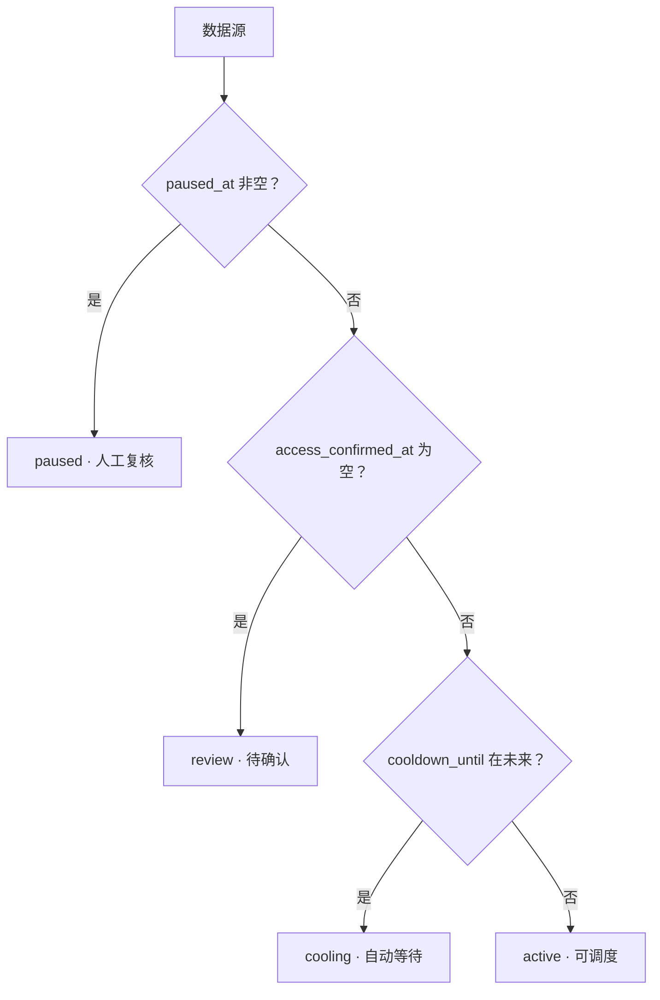

# 11 · 网络出口与访问边界

状态：**已实现**（2026-07-11，含容量退避、持久化冷却与人工复核）

## 1. 边界

payipa 只为已经确认授权的数据源提供稳定、可审计的访问。网络连通性不能扩大访问许可，任务、规则和 Agent 也不能
在运行时改变访问身份或网络路径来规避目标端限制。

系统遵循以下约束：

1. 出口由主机、容器平台或企业网关统一配置；应用不维护动态路由池。
2. 数据源必须记录访问依据、引用和确认时间，未确认的数据源不能运行。
3. `429/5xx` 属于容量与可用性信号，进入自动退避和冷却。
4. `401/403/451` 与交互式访问挑战属于授权边界，触发整源暂停和人工复核。
5. 被拒绝或处于挑战状态的响应不解析、不归档，也不自动更换账号、会话或出口继续尝试。
6. HTTP 与 Browser 引擎保持 TLS 校验，并遵守合同、服务条款、公开政策、API 文档和约定速率。

## 2. 部署职责

网络管理员可以在部署层设置固定的 `HTTP_PROXY`、`HTTPS_PROXY`、域名白名单、DNS 策略和出口审计。此类配置属于
基础设施，不进入数据源规则，不允许任务参数覆盖。应用只记录标准 HTTP 状态、稳定原因码、耗时和恢复状态，
不保存网络供应商凭证。

Browser 节点同样继承部署网络。Playwright 用于渲染动态页面和执行已授权的正常交互，不启用隐身补丁、设备指纹伪造、
验证码处理或身份轮换。

## 3. 数据源运行状态

| 字段 | 含义 |
|---|---|
| `access_basis` | `owned`、`contracted` 或 `public_policy` |
| `access_reference` | 合同编号、授权记录、API 文档或公开政策链接 |
| `access_confirmed_at` | 最近一次人工确认时间 |
| `paused_at` / `pause_reason` | 人工复核型暂停及原因 |
| `cooldown_until` / `cooldown_reason` | 容量信号触发的自动冷却及原因码 |
| `last_status_code` | 最近一次已记录 HTTP 状态 |
| `consecutive_failures` | 连续失败次数；成功后清零 |
| `last_success_at` / `last_failure_at` | 最近成功与失败时间 |

对外呈现的 `access_state` 由这些权威字段计算：



人工暂停与自动冷却不能混为一谈。冷却到期后调度可自动恢复；暂停只有访问复核可以解除。

## 4. 响应处理矩阵

| 信号 | 错误码 | 范围 | 恢复方式 |
|---|---|---|---|
| DNS、连接、TLS、连接重置 | `NETWORK` | 当前请求 | 指数退避，有限重试 |
| 传输超时、`408/425` | `TIMEOUT` | 当前请求 | 延迟重试 |
| `429` | `THROTTLED` | 请求 + 数据源 | `Retry-After`、源级冷却、AIMD 减速 |
| `500/502/503/504` | `UPSTREAM` | 请求 + 数据源 | 延迟重试、源级冷却 |
| `401/403/451` | `ACCESS_PAUSED` | 整个数据源 | 人工核对授权、账号与政策 |
| 明确的交互式挑战页 | `ACCESS_PAUSED` | 整个数据源 | 人工完成合法流程并复核 |
| 其他 `4xx` | `SOFT_FAIL` | 当前请求 | 修正规则或请求配置后重跑 |

`Retry-After` 支持秒数和 HTTP-date。主控会施加一秒下限、一小时上限，并写入请求 `not_before`；对 `429/5xx` 还会
写入数据源 `cooldown_until`。调度扫描与乐观占用均检查这两个时间，保证冷却窗口不会因并发竞态被穿透。

## 5. 整源暂停

Agent 检测到访问边界信号后，先停止解析和 raw 归档，再回报 `ACCESS_PAUSED`。主控在一个事务中记录暂停并终止尚未
派发的同源请求，随后向同源其他在途任务发送取消帧。批次在所有在途任务收口后正常完成，不留下永久“运行中”状态。

恢复入口为：

```text
POST /api/sources/{uuid}/access-review
```

批准时更新访问依据、确认时间并清理暂停与冷却状态；拒绝时保持暂停。操作要求登录和 `sources.write` 权限，结果写入
`audit_log`。恢复不会复活已经终结的旧请求；操作者应发起新批次，以保证审计和结果边界清晰。

## 6. 可观测与审计

监控接口展示运行状态、额定/有效速率、冷却结束时间、连续失败、最近 HTTP 状态、成功率、解析质量和错误分布。
机器原因码用于聚合，人类摘要用于复核；响应正文、Cookie、Authorization 和完整查询参数不会进入错误日志。

相关实现：

- `pyp_agent.response_policy`：响应分类和 Retry-After；
- `payipa.crawl.run`：冷却、重试预算、暂停、复核和调度过滤；
- `pyp_server.ratelimit`：令牌桶、AIMD 和进程内冻结；
- `pyp_server.routers.ws`：消费 Agent 回报并执行恢复动作；
- `payipa.monitor`：数据源健康聚合。
