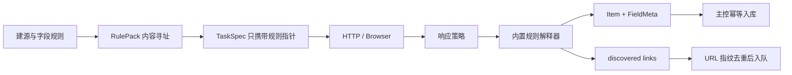

# 12 · 爬虫框架与旧代码接入

状态：**声明式采集主链已实现；代码化框架与旧爬虫托管仍在规划**（2026-07-11）

## 1. 三种采集形态

payipa 不要求每个数据源都写一套完整爬虫。采集复杂度应从低到高逐级升级，只有前一层无法表达需求时，才进入下一层：

| 层级 | 适用场景 | 当前状态 |
|---|---|---|
| 声明式规则 | HTML/JSON 字段提取、列表、链接发现、清洗 | 已实现，生产主路径 |
| 受约束 Crawler 子类 | Sitemap、列表详情、复杂分页、已授权 Browser 交互 | 设计完成，尚未形成独立包 |
| 旧代码/裸 Python | 迁移 Scrapy、requests 或历史脚本 | 沙箱边界已有，Agent 托管适配器未实现 |

声明式规则的优势不仅是简单。它由内置解释器执行，不需要运行任意代码，规则可以版本化、内容寻址、测试、审计和重放。
代码化采集的灵活性更高，但也引入依赖、资源、出网和结果协议问题，因此不能成为默认入口。

## 2. 当前声明式主链



框架横切能力已经由平台主链承担：

- 数据源访问依据与人工复核；
- HTTP/Browser 引擎选择和 Agent 能力匹配；
- 每源速率上限、令牌桶、AIMD、Retry-After 和持久化冷却；
- 批次、租约、重试预算、取消和断线回收；
- URL 指纹与数据指纹两道去重；
- 规则内容寻址、FieldMeta、raw 显式归档；
- 运行状态、解析质量和错误分布监控。

站点规则不能覆盖这些横切语义。特别是规则不能修改网络出口、禁用 TLS 校验、改变访问状态或自行实现身份轮换。

## 3. 代码化 Crawler 的目标形态

未来的代码化框架应采用模板方法模式，但仍服从主控的两层任务模型。`parse` 处理单个响应，发现的新链接必须通过
`follow()` 回传主控，不能留在 Agent 私有队列中。

```python
class BaseCrawler:
    async def parse(self, response: Response, ctx: CrawlContext) -> None:
        raise NotImplementedError

    async def emit(self, item: dict, *, meta: dict | None = None) -> None:
        ...

    async def follow(self, url: str) -> None:
        ...
```

基类负责生命周期、结果契约、错误归类和上下文；子类只描述站点语义。候选实现类包括：

- `SitemapCrawler`：展开标准 sitemap，再把页面 URL 交给主控入队；
- `ListDetailCrawler`：列表页发现详情链接，详情页产出记录；
- `ApiCrawler`：处理 API 分页、游标和结构化 JSON；
- `BrowserCrawler`：执行已授权的正常页面交互；遇到认证失效或挑战时停止并转人工；
- `FeedCrawler`：处理 RSS/Atom 等增量源。

早期文档曾将独立 `payipa-crawler` 包写成既定实现，但当前仓库并不存在这个包。正式落地时可以创建一个仅依赖
`payipa-contracts` 的轻包，供 Agent 执行端和主控校验端共同使用；在代码出现并有测试以前，它只能被称为规划。

## 4. AI 生成代码的边界

AI 可以补全抽象方法和站点字段映射，但不能生成或修改平台横切层。生成结果必须经过：

1. 静态语法与依赖白名单检查；
2. 固定 fixture 的 test 通道试跑；
3. 输出 schema、FieldMeta 和链接数量检查；
4. 管理员审核与内容哈希固定；
5. 沙箱执行和资源配额；
6. 小流量发布后再进入正式调度。

测试通过不代表拥有访问许可。数据源访问依据是独立门槛，不能由脚本测试结果替代。

## 5. 旧代码接入

旧代码迁移应按改造程度分为三档。

### 5.1 产出适配

保留旧请求和解析逻辑，只把数据库直写、文件散落或 `print` 输出改成平台 `emit(item)` 协议。Scrapy 可以通过
item pipeline 或 `item_scraped` 信号适配；简单脚本可以通过 SDK 提交 `list[dict]`。这一步解决数据归集问题，
但旧代码自己的重试、去重和并发仍然存在，不能声称已经获得平台全部调度语义。

### 5.2 调度托管

把旧程序包装成一个批次执行单元，由主控负责 cron、优先级、租约、取消、日志和结果状态。程序仍在沙箱中运行，
网络只允许访问经过批准的数据源和平台结果端点。代码不能直接连接平台数据库，也不能获得宿主 Docker socket。

### 5.3 语义迁移

逐步把本地队列改为 `follow()`，把自定义 HTTP 重试改为平台状态回报，把本地存储改为 `emit()` 和工件引用。
完成这一步后，旧程序才真正成为平台 Crawler，能够统一享受能力派发、冷却、访问暂停、数据质量和回放能力。

## 6. Scrapy 与 requests

Scrapy 的嵌入点是 `CrawlerRunner/CrawlerProcess` 与 item signal。平台适配器应注入保守的并发和下载延迟，
但权威速率仍在主控；必须避免“Scrapy 内重试三次、平台又重试三次”形成九次请求的重试乘法。

requests/niquests 脚本改造量更小，但同样必须将响应状态交给平台策略。脚本不得吞掉 `429`、认证失败或交互挑战后
伪装成空数据成功，否则监控无法区分目标端问题和页面确实为空。

## 7. 沙箱要求

旧代码托管复用 [04A-沙箱执行服务](04A-沙箱执行服务.md) 的原则：

- 容器只读、非 root、移除 capabilities、资源限额和墙钟超时；
- 出网采用显式域名/路径白名单，不开放任意网络；
- 取平台数据使用短期 job token，不提供 DB 凭证；
- 结果限制字节、行数和单行大小，拒绝符号链接与畸形结构；
- 依赖使用预构建、签名镜像，不允许任务运行时任意安装包；
- Docker/WSL2 可用，生产可选 gVisor；没有沙箱时只允许受信开发脚本降级本地执行。

当前 `SandboxExecutor` 服务于主控组装脚本。Agent 侧旧爬虫 sidecar 仍需实现控制协议、目标域白名单、镜像管理、
工件上传和取消传播后才能开放。

## 8. 接入验收

一个代码化采集器进入生产前，至少应通过以下验收：

| 类别 | 验收条件 |
|---|---|
| 授权 | 访问依据已确认，账号与数据范围可追溯 |
| 调度 | 无本地失控队列，取消与租约可收口 |
| 速率 | 429/Retry-After 能进入平台冷却，不产生重试乘法 |
| 访问边界 | 401/403/451/挑战页停止并转人工 |
| 数据 | 结果符合 schema，字段证据链可检查 |
| 安全 | 无 DB/S3 长期凭证，无 Docker socket，无任意出网 |
| 资源 | CPU、内存、PID、输出和墙钟均有上限 |
| 运维 | 日志包含 batch/req 关联键，失败可以回放和定位 |

## 9. 实现顺序

1. 定义 `payipa-crawler` 最小契约和 fixture runner；
2. 实现 `ListDetailCrawler` 与 `ApiCrawler`，复用现有 response policy；
3. 接入 test 通道、内容签名和发布状态；
4. 建 Agent sidecar 沙箱协议与镜像；
5. 提供 Scrapy pipeline 和通用 `emit()` SDK；
6. 最后实现 Browser 会话保险库与上下文池。

在这些步骤完成前，声明式规则仍是默认且最可靠的采集路径。
