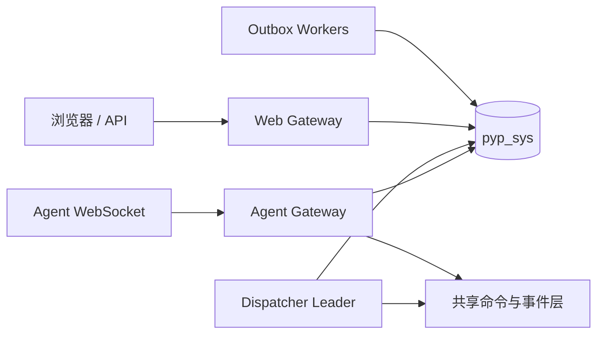
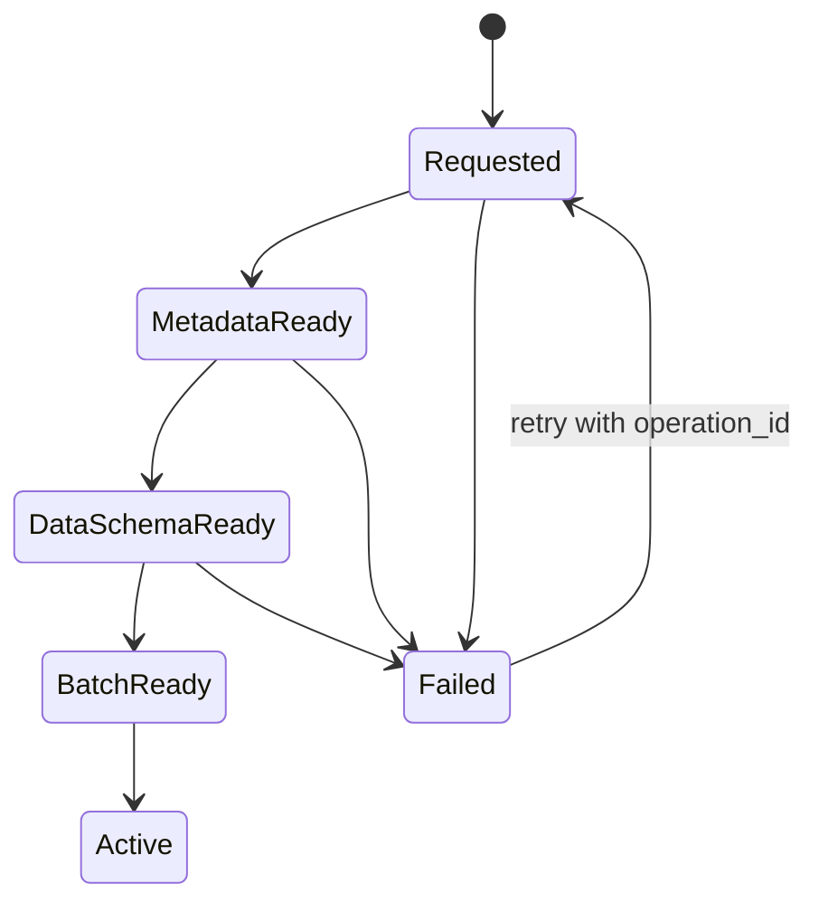
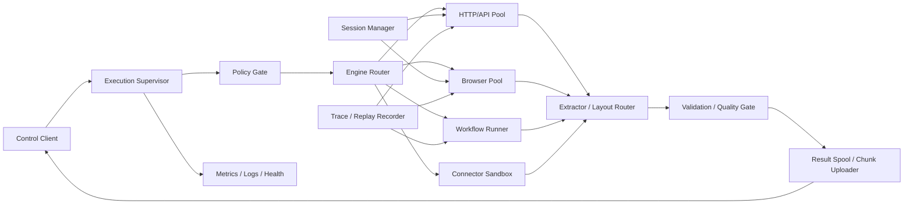
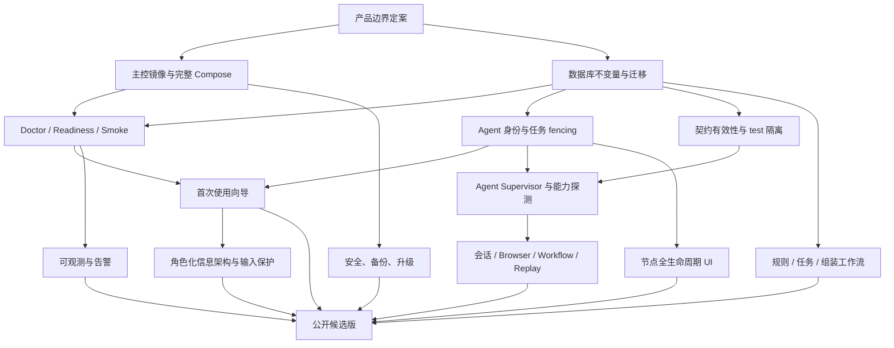

# 13 · 产品化发布审计与优化路线图

> 审计基线：2026-07-11，代码提交 `355bc1b`。
> 审计范围：主控、Agent、三库模型与迁移、采集与组装执行链、前端管理台、部署资产、测试与发布文档。
> 本文不是功能愿望清单，而是把当前工程收敛为可安装、可验证、可运维、可升级产品的执行基线。

## 1. 结论与发布判断

当前项目已经具备较完整的技术主链：建源、规则解释、Agent WebSocket 接入、持久化请求队列、采集入库、查询、组装底座、推送 Outbox、RBAC 和管理页面均有真实代码与测试。它已经超过原型阶段，但仍适合定义为“内部技术预览版”，尚不适合直接作为通用产品发布。

阻碍发布的不是某一个缺失页面，而是以下几条链路尚未闭环：

1. **没有官方、完整、可复现的主控部署产物**。仓库只有 Agent Dockerfile 和 Agent Compose，主控、三库初始化、迁移、管理员初始化、反向代理、持久卷、健康检查没有被编排成同一条安装路径。
2. **Agent 的身份生命周期没有完成**。当前使用一个长期共享 join token；主控签发的 `node_token` 被 Agent 忽略；容器主机名又会随重建变化，无法形成稳定、可撤销、可审计的节点身份。
3. **主控实际上只能单进程运行，但部署文档没有把这一点写成硬约束**。在线 Hub、限流器均为进程内状态，调度和推送循环又随每个 FastAPI 进程启动。直接配置多个 Uvicorn worker 会产生连接分片、限流倍增、定时任务和 Outbox 竞争等问题。
4. **“存活”不等于“可服务”**。`/healthz` 不检查三库、迁移版本、存储、后台循环或 Agent 链路；部署后没有一条自动化命令证明控制面、数据面和采集面都正常。
5. **部分文档声明超前于实现**。例如 S3 配置当前不会构建 S3 后端，Redis 没有进入运行主链，SSE 与 structlog 也没有实际接线；用户按文档配置后可能得到静默不同的行为。
6. **三库边界方向正确，但表内完整性和运行模型仍有高优先级问题**。规则按全局内容哈希误复用、请求规则引用冗余且无外键、动态表标识符校验不完整、跨库流程缺少可恢复状态、关键队列缺少组合索引和并发领取协议。
7. **Agent 还不是高复杂度站点执行平台**。当前 Browser 只做单次 `goto + content`，没有真实运行时探测、会话保险库、多步骤工作流、Trace/Replay、结果分块和引擎级资源治理。
8. **公开契约与真实执行存在漂移**。`fail_when`、`layout_match`、DFS 等字段没有进入执行语义；test channel 也没有真正隔离正式数据。继续扩展前必须先修正“可配置但不生效”。
9. **管理台“有页面”不等于“工作流闭环或用户友好”**。除多个核心页只读外，还存在大表单提交失败丢输入、技术术语和 raw JSON 直露、身份/健康状态误导、移动端登出不可达以及大量 `alert/confirm` 等问题。
10. **CI 会在没有 PostgreSQL 时跳过大量集成测试**。当前流水线不能证明迁移、三库、调度、Outbox、RBAC 和完整采集链在干净环境中可用。

### 1.1 当前成熟度

| 能力面 | 当前判断 | 主要缺口 | 发布影响 |
|---|---|---|---|
| 核心采集主链 | 基本可用 | test 隔离、契约有效性、容量边界、SSRF/范围约束、结果 fencing | 阻塞 |
| 主控部署 | 未产品化 | 无主控镜像、完整 Compose、初始化与升级工具 | 阻塞 |
| Agent 部署与纳管 | 部分可用 | 一次性入网、稳定身份、撤销、升级、诊断缺失 | 阻塞 |
| 高复杂度 Agent | 基础 Browser | 无会话、Workflow、真实能力探测、Trace/Replay、结果续传 | 高 |
| 三库模型 | 边界合理、完整性不足 | 规则关联、索引、跨库恢复、动态 schema 台账 | 阻塞 |
| 用户首次使用 | 未闭环 | 首次管理员、设置向导、示例任务、完成度指引 | 高 |
| 管理台 | 页面覆盖较广 | 多个核心页只读，输入保护、状态可信、详情、反馈和移动可达性不足 | 高 |
| 安全基线 | 有基础 | 内部端点、SSRF、共享密钥、Cookie/TLS、密钥轮换 | 阻塞 |
| 可观测性 | 较弱 | 无 readiness、指标、追踪、结构化日志规范、告警 | 阻塞 |
| 测试与发布 | 开发测试较多 | CI 无三库、无安装/E2E/升级/恢复测试 | 阻塞 |
| 文档 | 设计记录丰富 | 缺少面向安装者、管理员和终端用户的任务型文档 | 高 |

**建议的发布门槛**：完成本文全部 P0，完成 P1 中部署、数据完整性、用户主流程和可观测性项目，并通过第 15 章的发布验收后，才进入公开候选版。

## 2. 产品边界先定案

在继续增加功能前，应先冻结以下产品边界，否则部署、数据库和权限会反复返工。

### 2.1 v1 推荐支持范围

1. **正式支持 Linux x86_64 主控**。Windows 保留为开发环境；Docker Desktop/WSL2 可以用于本地验证，但不作为首个生产支持矩阵。
2. **正式支持单主控实例、单 Uvicorn worker**。允许多个远程 Agent；暂不宣传主控水平扩展或无停机高可用。
3. **正式支持两种存储形态**：小规模本地持久卷；生产对象存储。若对象存储尚未实现，首个版本只声明本地存储，不暴露无效 S3 配置。
4. **正式支持组织内单租户 RBAC**。当前 `tenant_id` 没有租户表、成员关系和查询隔离，不应宣传 SaaS 多租户。以后若做多租户，应作为完整项目实施。
5. **采集对象必须有明确授权或公开访问依据**。Agent 提供稳定抓取、会话管理和浏览器能力，但不把绕过访问控制作为产品能力。
6. **组装脚本只允许可信管理员发布，生产必须进入隔离执行器**。本地执行器仅用于开发，不允许静默降级。
7. **按 Agent 复杂度等级声明支持范围**。候选版至少稳定支持 A0-A4；A5 以 fixture 和未知版型隔离为前提；A6 只支持暂停、证据摘要与人工复核，不承诺自动通过挑战。

### 2.2 推荐部署档位

| 档位 | 用途 | 组件 | v1 支持建议 |
|---|---|---|---|
| All-in-One | 试用、小团队、验收 | PostgreSQL 三库、主控、迁移任务、本地存储、1 个 Agent | 官方首选 |
| Distributed Agent | 生产常用 | 单主控 + PostgreSQL + 对象存储 + 多台 Agent | 官方支持 |
| External Services | 已有基础设施 | 外部 PostgreSQL、S3、反向代理，主控与 Agent 独立 | 对象存储完成后支持 |
| HA Control Plane | 高可用 | 多 Web 网关、独立调度器、共享消息层、Leader 选举 | v1 明确不支持 |

## 3. 官方部署方案

### 3.1 部署产物

产品发布包至少应包含：

- `pyp-server` 生产 Dockerfile，运行时使用非 root 用户，镜像按 digest 固定基础镜像。
- `pyp-agent-http` 与 `pyp-agent-browser` 两个明确能力镜像，避免运行时才发现浏览器缺失。
- `compose.yml`：主控、PostgreSQL、三库初始化、迁移、反向代理、持久卷和可选 Agent。
- `compose.external.yml`：使用外部 PostgreSQL/S3 的覆盖配置。
- `pypctl` 或等价运维 CLI：`init`、`doctor`、`up`、`status`、`agent-token`、`smoke`、`backup`、`restore`、`upgrade`、`support-bundle`。
- 版本清单：server、core、contracts、agent、数据库 revision、镜像 digest、Git commit。
- `LICENSE`、`CHANGELOG.md`、`SECURITY.md`、支持矩阵和升级说明。

Agent Dockerfile 当前依赖仓库外的兄弟目录 `jianbing_utils`，而 Python workspace 又依赖 Git tag。发布构建必须统一为一种可复现来源，不能要求用户在克隆目录旁额外准备另一个仓库。

### 3.2 推荐安装顺序

正式教程应固定为以下顺序，并由工具自动执行或验证：

1. **校验发布包**：操作系统、CPU 架构、Docker/Compose 版本、磁盘、端口、时钟同步、镜像签名与 digest。
2. **生成配置**：创建 `.env`，生成各自独立的 session、upload、job、component-sign、agent-enrollment、KEK 密钥，不接受示例值。
3. **启动 PostgreSQL**：创建 `pyp_sys`、`data_center`、`business` 三个数据库和最小权限账号；等待数据库 readiness。
4. **执行迁移任务**：一次性容器运行 Alembic；检查三个库 revision 全部到 head；失败时停止后续启动。
5. **验证存储**：本地卷做写入、读取、删除测试；S3 做 bucket 权限和 multipart 测试。
6. **初始化系统**：播种 RBAC，交互式创建首个管理员；密码不得作为命令行位置参数进入 shell history 或进程列表。
7. **启动主控**：v1 明确 `workers=1`；反向代理配置 TLS 和 WebSocket 长连接超时。
8. **检查主控 readiness**：三库、迁移、存储、后台循环和配置均为绿色后才接收流量。
9. **签发一次性 Agent 入网码**：在主控页面或 CLI 生成短时、单次、带节点组和能力范围的 token。
10. **启动 Agent**：Agent 用入网码换长期节点凭证并持久化稳定节点 ID；随后只用节点凭证重连。
11. **执行链路冒烟**：运行内置、无外网依赖的 fixture 采集，证明任务下发、结果回传、`data_center` 入库、页面查询全部成功。
12. **再启用定时任务和推送**：避免初始化期间旧计划提前执行。

### 3.3 目标命令体验

下列是建议实现的产品接口，不代表当前仓库已经支持：

```bash
pypctl init                 # 生成配置与密钥，不启动服务
pypctl doctor               # 环境、端口、三库、存储、镜像与时钟检查
pypctl up                   # 按依赖顺序启动并等待 readiness
pypctl bootstrap-admin      # 交互式创建首个管理员
pypctl agent-token --group default --ttl 10m
pypctl smoke                # 内置 fixture 全链路验证
pypctl status --verbose     # 版本、迁移、循环、节点和存储状态
```

验收标准：在一台干净的受支持 Linux 主机上，用户只需准备 `.env` 和执行不超过三条顶层命令；不需要编辑 Python 文件、不需要手工执行 SQL、不需要理解 Alembic 内部结构。

### 3.4 主控容器与进程模型

1. 将 Web/API、调度循环、Outbox Consumer 的进程模型写入架构契约。v1 可同进程，但必须单 worker；后续再拆 `pyp-web`、`pyp-dispatcher`、`pyp-consumer`。
2. 不要为了运行沙箱而把 Docker socket 直接挂进对外 Web 容器。将沙箱 Runner 独立为受限服务，Web 只调用窄接口。
3. 迁移必须是显式 one-shot job，不能让每个副本启动时自动抢跑迁移。
4. 主控使用非 root 用户、只读根文件系统、独立可写数据卷和临时目录，设置 CPU/内存/PID/文件句柄限制。
5. 提供 `SIGTERM` 优雅关闭：停止接收新任务、等待或转移在途任务、停止后台循环、关闭数据库连接池。
6. 反向代理应明确 WebSocket Upgrade、空闲超时、请求体上限、可信代理头和真实客户端 IP 处理。
7. 正式镜像不安装开发依赖；依赖按 lockfile 安装，基础镜像和 uv 镜像固定 digest。

### 3.5 Agent 安装与纳管

推荐流程：

1. 管理员在“节点管理”点击“添加节点”，选择节点组、HTTP/Browser 能力和 token 有效期。
2. 页面显示一条 Docker 命令和一条 systemd/CLI 命令；一次性入网码只展示一次。
3. Agent 首次启动生成随机节点 UUID，写入持久卷中的身份文件；主机名只作为显示属性。
4. 入网成功后，主控保存节点公钥或 token hash，Agent 保存长期节点凭证；一次性 token 立即作废。
5. 节点页显示软件版本、契约版本、镜像 digest、能力、槽位、最近心跳、连接代次、证书/令牌到期时间。
6. 支持禁用、撤销凭证、轮换凭证、优雅下线、强制断开和重新入网；这些操作全部写审计日志。
7. Agent 本地提供 `pyp-agent doctor`、`status`、`enroll`、`run` 子命令，并支持代理、企业 CA、日志级别和身份目录参数。

### 3.6 主控与 Agent 关联稳定性测试

关联稳定不能只看 `/api/agents` 中出现一行。建议分五层验证：

| 层级 | 验证内容 | 合格标准 |
|---|---|---|
| L1 网络 | DNS、TLS、WebSocket 握手、证书链 | 连接成功，错误信息可定位到具体层 |
| L2 身份 | 一次性 token 消耗、长期凭证重连、撤销 | token 不可重放，撤销后 30 秒内断开 |
| L3 控制面 | ping/ack、心跳、槽位、版本与能力 | RTT、心跳漂移、连续丢失次数可见 |
| L4 任务面 | 内置 canary 请求下发、ack、执行、结果回报 | 每个阶段有时间戳和 correlation id |
| L5 数据面 | raw 上传、结果入库、页面查询 | 校验行数、指纹、工件 hash 一致 |

主控前端应提供“测试连接”动作，但真正逻辑落在服务端诊断 API。测试结果要显示失败阶段、耗时、Agent 日志关联号和修复建议。另需提供 10 分钟稳定性测试、断网重连测试、主控重启测试和 Agent 重启身份保持测试。

### 3.7 升级、回滚、备份与恢复

1. 发布前生成三库 schema 版本兼容表，明确 server 与 agent 的最低/最高兼容版本。
2. Agent 注册帧增加软件版本、构建 commit 和镜像 digest；主控节点页按兼容矩阵提示升级，不只校验 contracts 整数。
3. v1 可采用短暂停机升级，但步骤必须固定为：停止触发、等待在途、备份、迁移、启动、冒烟、恢复触发。
4. 回滚不能默认执行 Alembic downgrade。优先回滚应用镜像；只有迁移被验证可逆时才回滚 schema。
5. 备份范围必须同时覆盖三个 PostgreSQL 数据库、本地对象存储或 S3 bucket、发布配置、加密信封版本与 KEK 托管信息。
6. 每个版本至少做一次自动恢复演练。只生成备份而未在隔离环境恢复验证，不算备份闭环。
7. 给出 RPO/RTO 基线。例如内部版 RPO 24 小时、RTO 4 小时；正式版再根据业务提高。

## 4. 首次使用与文档体系

### 4.1 首次启动向导

首次登录后应进入可恢复的设置向导，而不是直接落到空白数据源页：

1. 检查主控、三库、存储和迁移状态。
2. 确认产品名称、时区、数据保留期和通知渠道。
3. 添加第一个 Agent，并运行连接诊断。
4. 从内置 fixture 创建示例数据源，完成一次采集。
5. 在数据页查看结果并下载示例 CSV。
6. 创建一个示例组装、在测试环境执行并查看产物。
7. 可选创建 Dataset API Key 或测试通知。
8. 完成后显示“系统已就绪”清单；管理员可以稍后重新打开向导。

向导状态应存服务端，而不是只存浏览器。不同角色看到不同的下一步：管理员看基础设施和成员，技术人员看 Agent/规则，运营看运行与数据。

### 4.2 文档信息架构

现有 `docs/00-12` 适合作为设计记录，但不能代替用户手册。建议新建以下稳定文档层：

```text
docs/
  install/
    docker-compose.md
    external-postgres-s3.md
    agent-docker.md
    agent-systemd.md
  admin/
    first-run.md
    users-rbac.md
    agents.md
    backup-restore.md
    upgrade-rollback.md
  user/
    sources-and-rules.md
    tasks-and-schedules.md
    data-explore-export.md
    assemblies.md
    push-and-datasets.md
  operations/
    health-and-metrics.md
    troubleshooting.md
    incident-runbook.md
    support-bundle.md
  developer/
    architecture.md
    local-development.md
    contracts.md
    migrations.md
    testing.md
  reference/
    configuration.md
    cli.md
    api.md
    compatibility.md
```

文档必须区分“已经实现”“实验性”“规划中”，并通过 CI 检查命令、相对链接和配置项。`QUICKSTART.md` 应只保留 10 分钟成功路径；PyCharm 调试、设计决策和生产部署分别进入不同文档，避免互相矛盾。

## 5. 主控与 Agent 架构优化

### 5.1 P0 可靠性修正

1. **完成身份闭环**：`RegisterAck.node_token` 必须被 Agent 校验、持久化并用于后续重连。共享 join token 只允许首次入网且必须短时、单次。
2. **稳定节点身份**：禁止默认使用易变化的容器 hostname 作为唯一身份。节点 UUID 存持久卷，hostname 可更新但不改变身份。
3. **处理重复连接**：同一 Agent 新连接应生成 connection generation；旧连接关闭时不得把新连接从 Hub 删除或把节点标记离线。
4. **注册失败应失败关闭**：生产环境数据库不可用时，不应“仅内存注册成功”。否则 UI、权重、分组、凭证和派发状态不一致。
5. **增加任务接收 ACK**：主控在下发后等待 Agent 确认，再从 ASSIGNED 进入 RUNNING；超时可安全重派。
6. **增加 attempt/fencing token**：每次派发产生不可复用的执行代次，结果回报必须匹配当前代次。迟到结果不能覆盖已经重派或取消的请求。
7. **Agent 本地强制槽位**：使用 semaphore 限制并发，即使主控错误超发也不能突破本机容量。
8. **主动存活检测**：WebSocket ping/pong、心跳超时和半开连接回收进入 Hub，而不只在数据库监控层判断“看起来离线”。
9. **优雅排空**：节点下线先进入 draining，不再接新任务；达到超时后再取消或重派在途任务。
10. **队列公平性**：当前每轮只看前 32 条，若这些请求都缺少匹配能力，后续可执行请求可能永久饥饿。领取查询应按能力/组过滤，或使用分页游标和公平队列。

### 5.2 单实例与水平扩展路线

v1 最稳妥的做法是承认并固化单实例：

- `pyp-server --workers 1`；Hub、限流器、调度和 Consumer 同一进程。
- readiness 明确检查后台循环是否仍在运行。
- 文档标明不支持多个主控副本，也不建议在外层做无状态 Web 扩容。

后续需要高可用时再整体拆分：



扩展时必须同时解决共享 Agent 路由、Leader 选举、分布式限流、任务 claim 和调度幂等，不能只把 Uvicorn worker 数从 1 改成 4。

## 6. 三库与表结构审计

### 6.1 当前边界判断

| 数据库 | 当前内容 | 判断 |
|---|---|---|
| `pyp_sys` | 26 张固定表：用户/RBAC、源与规则、任务/请求/节点、组装元数据、推送、AI 和配置 | 作为控制面基本合理 |
| `data_center` | 固定 `artifacts` + 动态 `data_*` | 原始与清洗后采集数据放置合理 |
| `business` | 动态 `asm_*`，无固定表 | 业务产物放置合理 |

不建议为了部署简单把三库重新合成一库。它们具有不同备份、保留、访问、容量和查询模式。真正需要优化的是跨库工作流、表内完整性与动态 schema 管理。

### 6.2 高优先级模型问题

| ID | 问题与代码证据 | 优化建议 | 验收标准 |
|---|---|---|---|
| DB-001 | `RuleStore.put` 只按全局 `content_hash` 查重，相同规则会错误返回另一个数据源的规则行 | 最小修复为唯一 `(source_id, content_hash)`；请求按真实 `rule_id` 关联 | 两个源使用相同 spec 时各自有正确版本和归属 |
| DB-002 | `requests` 同时保存 `rule_id`、`rule_version`、`rule_hash`，但 `rule_id` 无 FK，派发按 hash join | 以不可变 `rule_version_id` 为权威 FK；hash/version 从规则行读取，或明确做不可变快照 | 不存在跨源多行 join，孤儿规则引用为 0 |
| DB-003 | `setup_source` 用 `limit(1)` 隐含“一源一任务”，数据库却允许一源多任务 | 先定基数；若一对一加唯一约束，若一对多则 UI/API 必须显式选择 task | 不再依赖“第一条”隐式行为 |
| DB-004 | `sources` 同时承载配置、审批、限流和每个请求都更新的运行状态 | 将高频健康状态拆到 `source_runtime_state` 或异步聚合表，降低热点行争用 | 高并发同源采集不持续锁住配置行 |
| DB-005 | 初次创建 `data_*`/`asm_*` 时字段名和短码未统一经过安全标识符校验 | 建立唯一 `Identifier` 值对象；所有表名、字段名、product code 入口统一验证 | 恶意/非法标识符在事务和 DDL 前被拒绝 |
| DB-006 | 动态表不进入 Alembic，也没有权威 schema 台账 | 增加 `dataset_schemas`/`dataset_indexes` 元数据或可重建 manifest，记录 schema version 和 DDL 状态 | 可列出、比较、重建每张动态表结构 |
| DB-007 | 建源跨 `pyp_sys` 和 `data_center` 多次独立提交，失败可留下半成品 | 增加 `provisioning_state`、幂等 operation id、补偿/重试和 reconciliation job | 任一步失败后可自动继续或清理，不需手工 SQL |
| DB-008 | 初始种子插入未 `ON CONFLICT`，重复 URL 可回滚整个批次 | 创建批次时先规范化去重，并使用唯一索引冲突忽略 | 重复种子只生成一条请求 |
| DB-009 | Outbox 领取是先 select 再批量 update，无 `FOR UPDATE SKIP LOCKED`，多 Consumer 可重复领取 | 原子 claim，使用行锁跳过或带 claim token 的 update returning | 多 Consumer 压测无重复 claim |
| DB-010 | 调度到期查询和推进不是原子操作，多进程可重复创建批次 | 使用 advisory lock 或 `FOR UPDATE SKIP LOCKED`，推进与创建用幂等 fire key | 同一 schedule 时间点只产生一个批次 |
| DB-011 | 任务结果没有执行代次约束，迟到结果可覆盖当前状态 | `attempt_id`/`lease_token` 成为结果更新条件 | 重派后旧结果被记录为 stale，不改变当前请求 |
| DB-012 | 许多状态字段是任意字符串，缺少 check；slot、attempt、quota 也缺少非负约束 | 为稳定状态加 check constraint，为数值加范围约束 | 非法状态无法直接写入数据库 |
| DB-013 | 外键普遍没有明确 `ON DELETE`，部分关联甚至只是 BigInteger/String | 每个关系制定 restrict、cascade 或 set null；默认禁止删除可追溯历史 | 删除测试不会产生孤儿或误删历史 |
| DB-014 | `TimestampMixin` 只有 `created_at`，配置变更无法可靠显示更新时间 | 增加 `updated_at`；版本对象保持不可变，普通配置自动更新时间 | UI 与审计可区分创建和最近修改 |
| DB-015 | `owner_id/tenant_id` 大量为空，查询也未按 owner/tenant 过滤 | v1 明确组织内单租户并停止宣传租户隔离；或完整实现租户成员、FK、所有查询过滤/RLS | 文档、代码和测试只有一种真实语义 |
| DB-016 | `artifacts.task_id/source_id/attempt_id` 使用字符串且无跨库引用策略 | 使用稳定 UUID/ULID 作为跨库关联键，保存 `request_id` 与 attempt，建立来源索引 | 工件可从请求、批次、Agent 双向追溯 |
| DB-017 | 审计与任务事件没有保留策略和归档作业 | 按月分区或定期归档，提供 retention 配置与 dry-run | 过期数据可控删除，查询不随时间无界退化 |
| DB-018 | 规则、组装、推送组件按 `max(version)+1` 生成版本，存在并发竞争 | 唯一 `(logical_id, version)` + 锁定逻辑实体，或数据库序列化版本分配 | 并发创建版本不冲突、不跳归属 |
| DB-019 | 同一 product/component 可有多个 active 版本 | 发布事务中停用旧版，并加 partial unique active 约束或显式 release pointer | 任一逻辑产品只有一个当前发布版本 |
| DB-020 | 数据指纹仅对当前 fields 计算，算法/规范变化没有版本号 | 保存 `fingerprint_version` 和规范；升级提供重算策略 | 不同算法版本不会静默碰撞或重复 |

### 6.3 索引优化清单

索引应先用真实数据量和 `EXPLAIN (ANALYZE, BUFFERS)` 验证，但以下与现有查询直接对应：

- `requests (state, not_before, created_at, id)`，对 `state=QUEUED` 建 partial index。
- `requests (lease_until)`，对 ASSIGNED/RUNNING 建 partial index。
- `requests (batch_id, state)`、`requests (agent_id, state)`。
- `batches (task_id, created_at DESC)`、`batches (status, created_at)`。
- `schedules (next_run_at, id)`，对 `enabled=true` 建 partial index。
- `rules (source_id, status, version DESC)` 与唯一 `(source_id, content_hash)`。
- `task_events (batch_id, created_at)`；大规模后按时间分区。
- `audit_log (created_at DESC)`、`audit_log (actor_id, created_at DESC)`、`audit_log (object_type, object_id, created_at)`。
- `push_outbox (next_retry_at, id)` 对 pending 建 partial index；`lease_until` 对 inflight 建 partial index。
- `agents (status, last_heartbeat)`。
- `artifacts (expires_at)` 对未过期/待清理记录建索引；`(source_id, created_at)` 供追溯。
- `assembly_watermarks (assembly_id, source)` 已唯一，可补 `source` 反查索引视实际查询决定。

### 6.4 表的合并、拆分与保留

| 对象 | 建议 | 原因 |
|---|---|---|
| `requests.rule_id/rule_version/rule_hash` | 合并为一个权威规则版本 FK | 当前三份信息可不一致 |
| `global_params` | 若仍只存默认 LLM，合入 `llm_models.is_default`；否则升级为有 schema 的 typed settings | 通用 JSON 键值目前收益不足 |
| `credentials` | 二选一：真正作为统一 Secret Vault 被引用，或删除 | 当前是未接线的孤立表 |
| `storage_config` | 推荐基础设施配置走 env/secret manager 并删除死表；若要热切换则完整接线、校验和审计 | 当前页面能看到记录，但运行时不读取 |
| `sources` 运行健康字段 | 拆出，不合并 | 高频写与低频配置混在一行会争用和膨胀 |
| `tasks` 与 `schedules` | 暂时保留分表 | schedule 是 0..N 关系；只有产品明确永远 0..1 时才考虑合并 |
| `sources` 与 `tasks` | 保留分表 | 数据源身份/访问策略与运行定义生命周期不同 |
| `audit_log` 与 `task_events` | 绝不合并 | 安全审计和运行事件的保留、权限、查询模式不同 |
| `user_roles`、`role_permissions`、`user_permissions` | 保留 | 已明确需要多角色和特殊直授；应补外键删除策略 |
| `assembly_watermarks` | 保留 | 它是可重算增量状态，不应塞进 assembly JSON |
| `agents` 与内存 Hub | 不合并概念 | 数据库保存身份与期望状态，Hub 保存连接与瞬时槽位 |
| `data_*`、`asm_*` 与 `pyp_sys` | 保持隔离 | 数据量、权限、备份和保留策略不同 |

### 6.5 跨库一致性

当前“先写数据、后置状态”能保证成功状态不早于数据，但还不能保证所有异常都可恢复。建议为跨库命令建立轻量 Saga：



每一步持久化状态与错误，操作带幂等 `operation_id`。后台 reconciliation 定期扫描“元数据存在但动态表缺失”“请求成功但数据行缺失”“批次完成但 Outbox 未产生”等不变量，并提供只读报告和可审计修复动作。

## 7. 代码结构与实现质量

### 7.1 模块职责

`payipa.crawl.run` 已超过 1200 行，同时处理源、批次、请求、调度、Agent、重试、取消、监控查询。建议按领域行为拆分，而不是按 CRUD 拆分：

```text
payipa/crawl/
  source_service.py
  rule_store.py
  batch_service.py
  request_queue.py
  result_service.py
  agent_registry.py
  schedule_service.py
  reconciliation.py
```

FastAPI router 中存在较多直接 SQL。建议 router 只负责协议、鉴权、输入输出和 HTTP 错误映射；事务、审计和跨库编排进入 application service。不要为每张表创建空泛 Repository，只在需要封装不变量、复杂查询或测试替身时建立接口。

### 7.2 事务和状态机

1. 为 Request、Batch、Source、Assembly、PushComponent、Outbox 建立显式状态迁移函数，禁止任意字符串 update。
2. 状态迁移同时验证旧状态，使用 compare-and-set；重复请求返回幂等结果。
3. 关键业务动作与审计应在同一 `pyp_sys` 事务内。`best_effort` 只适合非安全通知，不适合权限、发布、凭证和删除。
4. Outbox 必须真正与产生事件的 `pyp_sys` 状态变更共用连接/事务；当前独立函数自开事务不满足“事务性 Outbox”定义。
5. 所有外部调用使用统一 timeout、retry、circuit-breaker 和错误分类，避免每个模块自行决定。

### 7.3 配置系统

1. 生成完整配置参考，标注类型、默认值、是否敏感、是否可热更新、作用进程和版本。
2. 删除或隐藏未接线配置。S3、Redis 一旦出现在 `.env.example`，启动时必须验证并真正使用，否则应明确报错。
3. 数据库连接池开放 `pool_size`、`max_overflow`、`pool_timeout`、`statement_timeout`、`application_name`，按进程模型给出默认值。
4. production preflight 扩展为：URL/TLS、Cookie、可信代理、数据库权限、迁移、存储、磁盘、密钥长度与域分离、后台进程模式。
5. 进程退出时 dispose 三个 AsyncEngine，测试和热重启不遗留连接。

### 7.4 异步与资源边界

1. 本地文件 `read_bytes/write_bytes` 和 zstd 压缩当前会阻塞事件循环；改为线程池或专用存储 worker，并使用临时文件 + 原子 rename。
2. `/internal/upload` 当前一次性 `request.body()` 读入内存；改为流式、总大小限制、压缩比限制和磁盘配额。
3. Agent HTTP 响应和 Browser HTML 增加最大字节数、内容类型白名单、下载超时和取消传播。
4. 后台循环将“最近成功 tick、连续失败、最后错误、当前处理数”写入运行状态，readiness 据此判断。
5. 统一 correlation id：HTTP request、batch、request、attempt、agent connection、outbox delivery 全链可关联。

### 7.5 代码卫生

1. 删除仍写着 M0/M1 stub 的过期 docstring，避免代码已实现而注释说未实现。
2. 清理未使用依赖与静态资源。当前未发现模板使用 HTMX 属性；若不采用 HTMX，应移除 vendored 资源和选型声明。
3. 引入 pyright 或 mypy，先覆盖 contracts、状态机和 service 层。
4. 对 clock、UUID、退避随机数和外部客户端使用显式依赖，减少时间相关测试偶发性。
5. 统一异常层级和 HTTP 错误 envelope，生产响应返回稳定 code、message、trace_id，不暴露内部异常文本。

## 8. Agent 与高复杂度站点能力

这里所说的“高难度”不应被简单理解成“绕过反爬”。真实难度通常来自动态渲染、登录会话、多步骤交互、接口签名、版型漂移、链接规模、限流和运行环境差异。Agent 的目标应是：在数据源拥有明确访问依据的前提下，用标准浏览器、受控会话、可回放工作流和充分诊断稳定完成任务；遇到访问拒绝、交互挑战或授权范围不清时暂停并转人工，而不是把规避访问控制做成通用能力。

### 8.1 当前 Agent 的真实能力差距

| 位置 | 当前行为 | 产品风险 | 建议 |
|---|---|---|---|
| `pyp_agent.fetch._fetch_http` | 每个请求新建 Session，只支持 GET | 无连接复用，API/POST/Headers/Body 场景无法表达 | 常驻 HTTP pool + 类型化 RequestPlan |
| `browser_available()` | 只检查 Python 包能否导入 | Chromium 未安装或不可启动时仍会上报 Browser 能力 | 启动时真实 launch/capability probe |
| `_fetch_browser` | 每任务启动 Chromium，只做 `goto` 和 `content` | 冷启动高、动态等待不足、无交互工作流 | Browser pool + 隔离 context + ActionPlan |
| `process_task` | 不传 headers/session/account，解析使用原始 target 而非最终 URL | 登录源不可用，重定向后相对链接可能错误 | 使用 scoped session，按最终 URL 解析 |
| `RulePack.fail_when` | 契约存在，但 Agent 未消费 | 站点自定义软失败规则看似可配、实际无效 | 编译并执行规则，记录命中证据 |
| `RulePack.layout_match` | 契约存在，但解析器未匹配版型 | 多版型页面无法选择正确规则 | 建版型路由器与未知版型隔离 |
| `CrawlStrategy.DFS` | 契约存在，调度固定按 depth 升序 | DFS 配置不生效 | 实现策略或删除无效选项 |
| `Channel.TEST` | 只写入 batch 字段，采集仍进入同一 `data_*` | 测试数据污染正式数据 | 独立 test dataset/schema 或显式不落正式库 |
| `TaskSpec.params` | 通用 JSON，执行端几乎不消费 | 配置无 schema、无法做兼容与权限检查 | 拆为版本化 FetchPlan/WorkflowPlan |
| Rule cache | 仅进程内、无容量上限、拉取端点无节点身份 | 长期运行内存增长，重启全丢，规则面暴露 | 有界磁盘缓存、hash 校验、机器认证 |
| Result 回传 | 单帧携带整页结构化结果 | 大页面可能超过 WS 限制或阻塞心跳 | 分块结果、对象引用、背压与大小预算 |
| 任务运行 | 网络与同步解析都在 Agent 主事件循环 | CPU 解析或大页面可能拖延心跳和取消 | Supervisor + 独立 worker/thread/process |
| 断连恢复 | 无本地结果暂存与 checkpoint | 已完成工作在断线窗口丢失，raw 可能成为孤儿 | attempt 绑定的本地 spool 与幂等续传 |
| CLI | token 在命令参数中，日志只有一行 print | 凭证可出现在进程列表，故障难诊断 | token file/env/secret mount + 结构化日志 |
| 能力模型 | 只有 engines/automation | 无法表达 Browser 版本、网络区、会话和资源差异 | 扩展 CapabilityManifest |

这些差距中，test 通道隔离、无效契约字段、结果资源边界和最终 URL 错用属于正确性问题，应在扩展更复杂能力前先修复。

### 8.2 复杂度分层

Agent 不应遇到失败就自动换更重、更隐蔽的引擎。推荐把数据源显式分层，并让测试诊断提出升级建议，管理员确认后才发布新的执行配置。

| 层级 | 典型场景 | 推荐执行器 | 关键能力 | 失败边界 |
|---|---|---|---|---|
| A0 | 静态 HTML、公开文件 | HTTP | 连接池、缓存校验、流式读取 | 普通重试/终止 |
| A1 | JSON/API、分页游标、Feed | API Connector | method/body、分页状态、schema 校验 | 401/403 暂停 |
| A2 | CSR/SPA、懒加载、Shadow DOM | Browser | 等待条件、滚动、frame/shadow 定位 | 挑战或越权暂停 |
| A3 | 已授权登录、MFA、账号配额 | Browser + Session | 人工建会话、租约、账号级限流 | 会话失效转人工 |
| A4 | 多步骤查询、表单、下载、状态机 | Workflow Runner | 有界 Action DSL、checkpoint、下载工件 | 步骤偏离即停止 |
| A5 | 多版型、频繁改版、字段质量波动 | Layout Router | fixture、版型识别、置信度、未知版型隔离 | 不把未知页当空成功 |
| A6 | 访问拒绝、交互挑战、法律限制 | Human Review | 证据摘要、暂停、复核、授权更新 | 不自动处理或绕过 |

对自有系统或有明确书面授权的系统，如果存在专有签名 API，应优先实现版本化 Connector 或使用官方 SDK。不要在通用 Agent 中提供任意注入、凭证提取或挑战破解接口。

### 8.3 目标 Agent 架构



各层职责必须清晰：

- **Control Client**：认证、契约、心跳、ACK、取消和重连，不执行站点逻辑。
- **Execution Supervisor**：按引擎管理槽位、进程、超时、取消、spool、资源和任务代次。
- **Policy Gate**：校验访问依据、域/路径/IP 范围、会话 scope、预算和发布签名。
- **Engine Router**：只按已发布 profile 选引擎，不在失败后擅自升级策略。
- **Session Manager**：处理短期会话租约、隔离、过期和人工续期，不把长期凭证放入任务体。
- **Extractor/Layout Router**：把传输与解析解耦，同一响应可以按版本化规则重放。
- **Quality Gate**：区分有效空结果、版型未知、字段缺失和软失败。
- **Result Spool**：结果分块、断点续传、幂等确认；主控 ACK 前不删除本地暂存。

### 8.4 类型化任务计划与能力清单

`TaskSpec.params: dict` 不足以承担复杂执行。建议增加不可变、版本化的计划引用，任务本身仍保持小而可复现：

```json
{
  "engine_profile": "browser-workflow/v1",
  "request_plan_ref": "sha256:...",
  "session_ref": "session:source/account/version",
  "network_scope_ref": "scope:source/version",
  "action_plan_ref": "sha256:...",
  "budgets": {
    "wall_s": 120,
    "response_bytes": 10485760,
    "steps": 30,
    "pages": 20,
    "download_bytes": 52428800
  },
  "capture_policy": "errors-and-test"
}
```

计划里只保存引用，不保存 Cookie、密码或 API Key。每个计划发布时完成 schema 校验、fixture 测试、内容哈希和签名。

Agent 注册时上报 `CapabilityManifest`：

- agent/contract/build 版本、OS、架构和容器镜像 digest；
- HTTP 协议能力、企业 CA、网络区域和允许访问的 source group；
- Browser 类型、真实版本、二进制 launch 结果、支持的 frame/shadow/download/trace 特性；
- `http_slots`、`browser_slots`、`workflow_slots`，而不是一个混合 `slot_n`；
- 可用沙箱 runtime、磁盘 spool 容量、内存和 CPU 预算；
- Session 能力、会话版本和允许的账号组，但不包含任何明文凭证。

主控只把任务派给完全满足计划要求的 Agent；能力不足应显示“缺少什么”，而不是排队到超时。

### 8.5 HTTP、Browser 与 Workflow 执行器

#### HTTP/API Pool

1. 复用进程级客户端与连接池，按 origin 设置连接数、并发和空闲回收。
2. 支持 GET/POST/PUT 等批准的方法、query/body/content-type 和幂等重试策略。
3. 支持流式响应、最大压缩比、最大正文、字符集判定、校验和与取消传播。
4. 支持 ETag/Last-Modified、增量游标和官方 API 配额，但不能让站点规则关闭 TLS 校验。
5. Headers 从发布配置和 scoped secret 合成；日志只记录允许字段和 hash。

#### Browser Pool

1. 预热少量 Browser 进程，每个任务使用独立 context；进程达到页数、内存或错误阈值后轮换。
2. 对登录型源使用专属持久 context 或解密后的 storage state，禁止跨源、跨账号复用。
3. 等待策略支持 DOM、selector、network idle、特定响应和业务断言，并设总墙钟上限。
4. 支持 iframe、Shadow DOM、SPA navigation、受限滚动和下载工件；所有循环都有步数和字节预算。
5. 使用标准、受支持、及时更新的浏览器环境。语言、时区和设备配置应与授权会话一致且可审计，不使用通用“隐身”补丁伪造身份。

#### Workflow Runner

复杂交互使用有界 Action DSL，而不是直接让每个数据源执行任意 Python：

- `navigate`、`wait_for`、`click`、`fill`、`select`、`scroll`、`expect`、`capture`、`download`；
- 每步有 timeout、前置断言、后置断言、重试上限和脱敏日志；
- 循环只能对受限集合或有明确上限的分页执行；
- 选择器和步骤版本化，运行偏离时停在具体步骤并提供诊断证据；
- MFA、验证码和额外授权步骤只能人工完成，不接自动破解服务。

#### Connector Sandbox

对于自有系统、官方 SDK、Scrapy 或经过审计的旧程序，使用签名镜像和窄 SDK 运行。脚本只能 `emit/follow/artifact`，不直连数据库、不持有 Docker socket、不任意安装依赖，出网范围仍由 Policy Gate 控制。

### 8.6 会话保险库与人工接管

高复杂度站点最需要的往往不是更激进的请求，而是稳定、合法、可维护的会话生命周期。推荐流程：

1. 管理员创建账号配置，只记录用途、所有者、允许域、并发和到期策略。
2. 系统在专用 Browser Agent 上启动隔离会话；操作者通过受控本地窗口或短时远程会话完成登录、MFA及必要确认。
3. Agent 导出 browser storage state，使用主控公钥加密后上传；主控存密文和 key version，不保存操作录像中的密码输入。
4. 运行任务获得短期 session lease，绑定 source、account、Agent group、用途和并发；租约结束即从内存清除明文状态。
5. 健康检查访问一个低成本、已批准页面判断登录态。失效时暂停该账号的新任务并通知维护人，不连续撞登录页。
6. 人工续期生成新 session version；已派发任务继续使用旧 lease 或安全取消，不在运行中热替换。
7. 支持撤销、强制登出、设备清单、最后使用、异常使用告警和完整审计。

人工接管页面要明确展示目标域、账号别名、授权依据、剩余时间和“正在保存哪些会话状态”。它是会话维护工具，不是挑战绕过器。

### 8.7 测试诊断、Trace 与回放

复杂站点没有可回放证据就无法稳定维护。测试通道建议采集：

- 导航阶段、最终 URL、重定向链、主文档状态、关键响应时间；
- 经脱敏的 request/response metadata，可选 HAR；Authorization、Cookie、token 和敏感 query 默认删除；
- 页面截图、DOM snapshot、console/page error、失败步骤和 selector 命中数；
- 版型匹配结果、字段原值/清洗值、未知字段、质量断言和发现链接统计；
- 实际 Browser/Agent/plan/rule/session version。

生产默认只保留指标和错误摘要；详细 capture 需要时间受限、权限受控的诊断开关。HAR/DOM/截图可能包含个人数据，必须继承数据源权限和保留期。

建立离线 Replay Runner：给定响应、DOM/HAR fixture 和固定规则，不访问目标站即可重放解析、版型和工作流断言。AI 可以根据失败证据提出选择器或规则修复建议，但必须经 fixture、人工审核和发布签名，不能在生产任务中自行改规则。

### 8.8 稳定性与资源治理

1. Supervisor 为每个任务维护 `RECEIVED -> PREPARED -> RUNNING -> SPOOLING -> REPORTED -> ACKED` 状态，全部绑定 attempt token。
2. 网络、Browser 和解析使用不同 worker/资源池，CPU 密集解析不阻塞心跳。
3. Agent 本地 spool 使用加密、容量上限和 LRU/优先级清理；未 ACK 成功结果不得静默删除。
4. Result 采用分块或对象引用，主控逐块校验 hash；WS 只传控制帧与小摘要。
5. Browser crash、page crash、worker OOM 和 Agent 重启具有稳定错误码；只有幂等且在预算内的步骤才能自动恢复。
6. Workflow 在安全 checkpoint 保存非敏感进度；恢复前重新校验 session、页面和 attempt，不能盲目从点击中间态继续。
7. Agent 启动真实探测 DNS、TLS、主控、上传、浏览器 launch、spool 写读和时钟；任一能力失败只撤下该能力，不虚报健康。
8. 每引擎独立槽位和资源配额。HTTP 高并发、Browser 低并发、Workflow 更低并发，避免一个 `slot_n` 造成错误容量估计。
9. 支持 draining、升级、磁盘低水位和浏览器内存高水位状态，主控据此停止派发并给出原因。

### 8.9 网络范围与访问边界

1. 数据源必须定义 `allowed_domains`、协议、端口、路径范围、最大深度、最大页面数和最大总字节数。
2. 种子、发现链接、iframe、下载和重定向每一跳都做 SSRF 防护：拒绝 loopback、link-local、私网、云元数据和 DNS rebinding，除非管理员显式批准受控内网源。
3. URL 规范化明确 query 排序、追踪参数、默认端口、大小写、百分号编码和 trailing slash 策略。
4. 发现链接使用最终响应 URL 作为相对地址基准；跨域链接先进入 policy filter，不直接入队。
5. 401/403/451、明确交互挑战、授权范围偏离或站点政策变化时整源/账号暂停。系统可提供证据摘要、会话续期和人工复核，但不自动切换身份、出口或破解挑战。
6. 官方 API、数据导出或合作方接口可满足需求时优先使用，Browser 只是正常交互和动态渲染执行器。

### 8.10 规则与连接器工作流

1. 新建数据源改为“保存草稿 -> 获取样本 -> 规则预览 -> 测试运行 -> 发布 -> 正式运行”，不要提交表单后立即创建并运行。
2. 规则页提供编辑、fixture 测试、字段预览、版本 diff、发布、回滚和影响分析。
3. 为每个规则版本保留 fixture 与预期输出，CI 可离线回归。
4. 完成 `BaseCrawler`/Connector SDK，提供稳定接口、版本兼容和示例包；旧脚本只通过 Agent sidecar 沙箱接入。
5. 增加批次级 page budget、去重统计、出域统计和终止原因，防止链接爆炸。
6. 把访问许可、允许范围、限流、账号会话和 Agent 能力放在数据源详情页同一处，运行前可一眼确认。
7. `fail_when`、`layout_match`、crawl strategy 和 test channel 必须有契约测试，未实现的字段不得在 UI 中显示为可用。

### 8.11 Agent 验收场景

| 场景 | 必须验证的结果 |
|---|---|
| 静态 HTML + 重定向 | 使用最终 URL 解析相对链接，连接复用可见 |
| JSON POST + 游标分页 | method/body/schema/游标可复现，重试不重复写 |
| SPA + 懒加载 | 等待和滚动有上限，Browser context 正确回收 |
| iframe + Shadow DOM | 定位器可表达，命中证据可回放 |
| 已授权登录 + MFA | 人工建会话、短期 lease、到期暂停和续期生效 |
| 多步骤查询 + 下载 | 失败定位到具体步骤，下载受域/大小限制 |
| 多版型和未知版型 | 已知版型正确路由，未知版型不写空成功 |
| 429/5xx/网络抖动 | 尊重 Retry-After、预算和断路器，无重试乘法 |
| 401/403/交互挑战 | 停止、脱敏取证、人工复核，不自动绕过 |
| Browser crash/Agent 重启 | attempt fencing、spool 和幂等恢复正确 |
| 大结果和断线 | 分块续传、hash 校验、心跳不被阻塞 |
| test 通道 | 数据、工件、通知和推送均不进入生产空间 |

## 9. 沙箱方案

当前 `SandboxExecutor` 已有只读根、cap drop、no-new-privileges、PID/CPU/内存限制、internal network 和窄 Gateway 等良好基础，但部署形态仍需产品化：

1. **生产 fail closed**：Linux 容器运行时不可用时拒绝执行，不允许自动退回 `LocalExecutor`。
2. **Runner 独立进程/主机**：对外 Web 主控不持有 Docker socket；Runner API 只接受签名作业描述和短期 job token。
3. **镜像固定 digest**：`python:3.14-slim`、`nginx:alpine` 不使用浮动 tag，构建内部 runner 镜像并做签名与扫描。
4. **运行时加固**：支持 rootless、seccomp、AppArmor/SELinux；高风险场景可选 gVisor/Kata，但不要假定所有环境都有 `runsc`。
5. **池隔离语义明确**：常驻 worker 只跑可信管理员脚本；不可信或不同租户作业使用一次性容器，防止进程内残留。
6. **作业队列与配额**：限制每用户并发、CPU 秒、内存、输出行数、输出字节和 Gateway 查询量。
7. **自愈与清理**：主控异常后扫描并清理孤儿容器、网络、临时目录；每项操作有指标和审计。
8. **可观测**：记录排队、冷启动、执行、Gateway、写回各阶段耗时；保留截断后的 stdout/stderr 和稳定错误码。
9. **版本协议**：Runner 镜像、job spec、Gateway API 均有版本，升级时做兼容检查。
10. **安全回归**：文件穿越、符号链接、fork bomb、内存、网络逃逸、超大输出、超时杀进程和容器复用污染进入 CI。

## 10. 前端与产品工作流

### 10.1 当前页面缺口

| 页面 | 当前能力 | 产品化补齐 |
|---|---|---|
| 数据源 | 新建即运行、重跑、访问复核 | 草稿/编辑/复制/归档、测试运行、详情、范围与容量预算 |
| 任务 | 清单 | 创建/编辑、启停、cron 校验、立即运行、取消、批次详情、重试失败项 |
| 规则 | 清单 | 编辑器、样本抓取、预览、diff、测试、发布、回滚 |
| 组装 | 已有记录的状态与发布 | 创建/编辑、语法校验、测试执行、产物预览、运行历史、回滚 |
| 推送 | 创建、状态、发布、测试入队 | 编辑、投递历史、死信详情、重放、凭证轮换、目标连通测试 |
| 节点 | 指标清单 | 添加节点、复制命令、测试、配置槽位/组、drain、禁用、撤销、升级提示 |
| 用户 | 创建、启停、角色、密码 | 会话撤销、强制改密、登录历史、可选 MFA/SSO |
| 角色 | 只读清单 | 权限矩阵编辑、差异预览、危险权限确认 |
| 公共配置 | LLM/Prompt/通知部分可写 | 明确配置来源、测试、版本、回滚、密钥状态；移除无效存储配置 |
| 存储 | 只读统计 | 容量、写读测试、保留策略、GC、工件详情；基础设施配置仍建议走部署层 |
| 日志 | 静态说明 | 可检索运行日志入口、trace 跳转、下载 support bundle |
| API Key | 无页面 | 创建、scope、配额、过期、轮换、撤销、最后使用时间 |

### 10.2 当前可用性复核

| 证据位置 | 当前体验问题 | 用户影响 | 解决方案 |
|---|---|---|---|
| `source_new.html` | 名称、短码、授权、运行参数、选择器和指纹挤在一个大表单 | 初次用户无法判断先后关系，错误成本高 | 分步向导 + 草稿 + 测试预览 |
| `sources_create` | 服务端报错后没有回填提交值，模板恢复静态默认 | 用户修改内容全部丢失 | 使用 FormModel 回显、字段级错误和草稿保存 |
| `source_new.html` | 直接显示 `data_{短码}`、`item_locator`、CSS、store/link 等内部术语 | 运营用户必须理解存储和解析实现 | 普通模式使用业务语言，技术字段放“高级设置” |
| 新建数据源 | 提交即创建、发布并运行 | 配置错误直接进入正式链路 | 草稿、样本、测试、发布、运行分开 |
| `base.html` | 用户身份下方固定显示“管理员” | 非管理员被错误告知身份，降低权限可信度 | 展示真实角色/组织，支持角色详情 |
| `base.html`/`ui.py` | 所有人看到全部导航，权限只在数据端点拒绝 | 经常进入 403 空壳，不知道自己能做什么 | 服务端计算 capability map，按权限渲染导航与动作 |
| 移动端 CSS | 12 个导航项变成一条横向滚动，身份与登出被隐藏 | 难发现功能，移动端无法正常退出 | 移动抽屉/任务型底栏，保留账号菜单 |
| 多个模板 | 使用 `alert()`、`confirm()` 和 2.5 秒按钮文字 | 反馈易丢、不能查看历史、无法无障碍操作 | Toast + 确认对话框 + Operation Center |
| `views.js` | 401 只显示错误文本，不跳登录也不保留未提交内容 | 会话过期后用户被卡住或丢工作 | 全局 session-expired 流程，保存草稿后重登录 |
| `views.js` | 时间直接去掉 `T`，未做时区、相对时间和完整 tooltip | 不同地区用户容易误判任务时间 | 统一时区组件，显示本地时间 + 原始 UTC tooltip |
| `monitor._rate` | 无样本时成功率返回 1.0 | 新数据源可能被显示为 100% 健康 | 返回 `null/no_sample`，UI 显示“暂无样本” |
| Dashboard | 只有总数和健康表，没有待处理事项与详情入口 | 看到了异常但不知道下一步做什么 | 按严重度列“需要处理”，直达对象和处置动作 |
| 通用清单页 | 多数无搜索、筛选、分页、保存视图和批量动作 | 数据稍多就难以日常运营 | 统一 DataTable 行为和 server-side query |
| `config.html`/`push.html` | 常用配置要求手写 JSON 或 Python 源码 | 易输错、无法发现字段、凭证风险高 | 按 provider/type 生成 schema 表单，源码编辑进入专家模式 |
| `data.html` | 可见文案包含 “Tabulator remote”“服务端译 SQL” | 面向用户暴露实现细节，没有解释数据业务含义 | 改为任务语言，技术信息移到开发者诊断区 |
| 图标按钮 | `◎`、`✕` 等部分按钮无可访问名称 | 屏幕阅读器无法判断用途 | 统一 IconButton，补 `aria-label`、tooltip 和焦点态 |
| 自动刷新页 | 定时替换 DOM，没有刷新暂停、aria-live 或焦点保护 | 阅读、复制和辅助技术使用被打断 | 差量更新、页面隐藏暂停、手动刷新与刷新状态 |
| 主题系统 | 四套皮肤投入较多，但核心任务状态仍不完整 | 视觉选择先于工作流可靠性 | 保留一个正式默认主题，其他主题降为实验设置 |
| Picker 扩展 | 开发者模式安装，`<all_urls>` 权限 | 普通用户安装困难且权限提示过宽 | 商店/企业分发，activeTab/optional host permissions |
| 页面结构 | 缺少对象详情页、面包屑和关联上下文 | 用户在源/规则/任务/数据之间反复跳转 | 以对象为中心的详情页和标签导航 |

因此，当前界面“技术人员可以操作”，但还没有达到“目标用户能放心、连续、可恢复地完成工作”。前端优化的第一目标不是增加动画或皮肤，而是降低认知负担、保护用户输入、解释系统状态并给出下一步。

### 10.3 用户角色与信息架构

先按真实职责设计首页和导航：

| 角色 | 最常见任务 | 默认首页 |
|---|---|---|
| 安装/系统管理员 | 部署状态、成员、权限、密钥、升级、备份 | 系统就绪与风险清单 |
| 采集技术人员 | 数据源、规则测试、Agent 能力、失败诊断 | 我的数据源与待修复规则 |
| 数据运营人员 | 运行任务、查看质量、重试、导出、推送 | 今日运行和待处理异常 |
| 数据产品/审计人员 | 查询数据、组装产物、追溯来源、审计 | 数据产品与访问记录 |

推荐一级导航收敛为：

1. **工作台**：当前用户待处理事项、最近操作、常用对象。
2. **数据获取**：数据源、任务和 Agent，按对象关系串联。
3. **数据与产品**：采集数据、组装、Dataset API 和推送。
4. **运行中心**：运行历史、队列、告警、日志与工件。
5. **系统设置**：用户/RBAC、模型、通知、存储状态和部署信息。

导航和按钮由同一 capability map 决定。没有管理权限的运营人员不应看到“用户管理”“密钥”“发布脚本”等入口；没有 Browser Agent 时，Browser profile 可以可见但标为“需添加对应节点”，并提供直达动作。

每个核心对象使用详情页，而不是只有全局清单。例如数据源详情页包含：

```text
概览 | 配置 | 规则与样本 | 任务与运行 | 数据 | 会话与访问 | 指标 | 审计
```

这样用户可以在一个上下文中完成“为什么失败、改什么、测试是否通过、何时发布”的完整判断。

### 10.4 首次使用与核心工作流

#### 数据源创建

推荐六步向导：

1. **基本信息与访问依据**：名称、用途、负责人、授权记录。
2. **目标与范围**：种子地址、允许域/路径、页面和字节预算；即时测试 DNS/TLS/可达性。
3. **执行方式**：系统根据样本建议 HTTP/API/Browser/Workflow，展示成本和所需 Agent；高级参数折叠。
4. **样本与字段**：抓取测试样本，点选或输入字段；实时显示命中数量和示例值。
5. **质量与去重**：指纹建议、空值/唯一性预览、未知版型和链接扩展估算。
6. **测试与发布**：test 通道运行，展示请求、产出、错误和资源预算；通过后才能发布并选择立即运行或定时。

每一步都能保存草稿、返回、退出后继续。用户不需要自己创建短码；系统自动生成稳定 slug，只有专家模式可修改。选择器、速率、超时和 retry 使用有解释的控件与安全默认值，不让用户面对空白技术字段。

#### 运行与故障恢复

批次详情使用时间线展示：创建、排队、分配、Agent ACK、请求、解析、上传、入库、组装和推送。每个失败显示：

- 发生在哪一阶段；
- 稳定错误码和人类解释；
- 是否已自动重试、剩余预算和下次时间；
- 影响多少请求/数据；
- 推荐动作，如“等待冷却”“续期会话”“添加 Browser 节点”“修复选择器”；
- 可用动作：重试失败项、从 fixture 重放、暂停源、进入访问复核。

用户触发重跑后，不应把 batch id 在按钮上闪两秒就消失。系统应创建持久 operation，并在运行中心和对象详情显示进度及结果。

#### Agent 纳管

添加 Agent 使用向导：选择部署方式 -> 生成一次性命令 -> 等待连接 -> 自动诊断 -> 运行 canary -> 分配节点组。每一步显示完成状态和原始诊断摘要；失败时可以复制脱敏报告，而不是只显示“离线”。

### 10.5 表单、配置与输入保护

1. 所有服务端校验错误回填原值，并把焦点移动到错误摘要；每个字段下显示具体问题。
2. 长表单自动保存草稿；浏览器刷新、返回和会话过期后可以恢复。敏感字段不存 localStorage。
3. 普通配置使用 schema-driven form：provider、通知类型、存储后端选择后显示对应字段、示例、校验和“测试连接”。
4. JSON、cron、选择器和源码编辑只在专家模式出现，提供格式化、语法检查、diff 和恢复默认。
5. 安全默认值由系统给出，并解释影响。例如速率优先保守，Browser 并发按机器探测，而不是默认 1000 req/s 可选。
6. 提交按钮防重复，显示处理中状态；离开未保存页面时提醒，但已经自动保存的草稿不反复打扰。
7. 密钥输入支持“保持原值/替换/撤销”，保存后只显示前缀和最后更新时间，不用空字符串表达未知语义。
8. 日期时间统一由服务端返回 ISO/UTC，前端按用户时区显示并附绝对时间；相对时间只作辅助。

### 10.6 反馈、确认与可恢复操作

1. **Toast** 只用于短暂、可忽略的成功提示；错误和需要行动的信息进入持久通知中心。
2. **Operation Center** 保存安装、迁移、测试运行、导出、重跑、发布、GC 等长任务，用户可离开页面后继续查看。
3. 危险操作使用一致对话框，显示对象、影响范围、在途数量和可逆性；不能只依赖浏览器 `confirm()`。
4. 可逆动作优先软删除/归档并提供短期撤销；不可逆动作要求输入对象名或二次审批。
5. 401 由统一 API client 捕获：先保存非敏感草稿，跳登录，成功后返回原位置并恢复操作上下文。
6. 403 同时显示缺少的业务权限和申请路径，不向普通用户暴露内部权限码作为唯一解释。
7. 409/幂等冲突显示当前对象状态和“刷新/查看已有操作”，不把重复点击变成未知错误。
8. 错误页和空状态都有主动作、次动作和诊断 id；不能只写“暂无数据”或 “HTTP 500”。

### 10.7 仪表盘、数据表与可信状态

1. 仪表盘优先展示“需要处理”，如无 Agent、队列老化、暂停源、会话将过期、规则质量下降、磁盘低水位和待升级节点。
2. 每个异常卡可点击到过滤后的对象清单，并显示责任人、持续时间和建议动作。
3. 指标必须有时间范围、样本量和更新时间。无样本显示“暂无样本”，绝不显示为 100% 成功。
4. 队列不仅显示数量，还显示最老等待时间和主要阻塞原因；成功率同时展示分母。
5. 通用表格支持服务端分页、排序、筛选、列显示、保存视图、固定关键列、批量选择和导出当前筛选。
6. 行主操作固定且不随列宽漂移，低频动作进入菜单；移动端改为摘要列表或详情抽屉，不强塞宽表。
7. 数据详情显示字段证据、来源 URL 的脱敏形式、batch/req/rule version 和 raw 工件权限入口，支持逐行追溯。
8. test/prod 使用明显但克制的环境标识，测试数据、工件、通知和推送不能与正式空间混淆。

### 10.8 视觉、移动端与可访问性

1. 采用一个稳定、安静、适合长时间工作的正式主题；多套皮肤放到实验设置，不能影响布局或语义颜色。
2. 保持页面密度适中，正文、标签、状态和操作有稳定层级；不要用粗重边框和硬阴影压过业务信息。
3. 移动端使用可关闭抽屉或任务型导航，账号、帮助、通知和登出始终可达；所有按钮触控区足够大。
4. 增加 skip link、主区域 landmark、标题层级、表格 caption/scope、可见焦点和完整键盘路径。
5. 图标来自统一图标组件，图标按钮有 `aria-label` 和 tooltip；状态不能只靠颜色表达。
6. 自动刷新提供暂停和手动刷新；更新不抢焦点、不重置滚动、不打断屏幕阅读器。
7. 对 360px、768px、桌面和宽屏做截图与交互回归，最长中文/英文名称、错误文本和密钥前缀不得溢出。
8. Picker 扩展改用最小权限：用户主动启动时申请当前站点，展示当前授权域，支持随时撤销。
9. 以项目选定的 WCAG AA 基线做自动检查和人工键盘/读屏验收，不用“颜色看起来够深”代替测试。

### 10.9 前端实现路线

无需为了产品化立即重写为独立 SPA。当前 SSR 架构可以继续，但要形成工程化前端层：

- Jinja macro/component 统一 Button、IconButton、Field、Dialog、Toast、Badge、EmptyState、DataTable 和 OperationStatus；
- 一个统一 API client 处理 JSON、CSRF、401/403/409、trace id、取消和超时；
- 模板内联脚本迁到 ES module；HTMX 要么成为明确的交互主线，要么移除，不维持“双方案”；
- 表单使用共享 schema/DTO，服务端和前端错误字段一致；
- 服务端把真实角色、capabilities、timezone 和 feature flags 注入页面上下文；
- 建立 CSP nonce/hash，禁止无约束内联事件处理；
- Playwright 覆盖主流程、权限、会话过期、失败恢复、键盘和响应式视口。

### 10.10 人性化验收标准

- [ ] 目标角色首次使用者不看源码、不执行 SQL，可完成 Agent 接入、建源测试和查看数据。
- [ ] 普通路径不要求手写 JSON、数据库表名、权限码或 Python；复杂字段有专家模式。
- [ ] 任一表单校验失败、刷新、返回或会话过期都不丢失非敏感输入。
- [ ] 所有长任务有持久进度与结果，关闭当前页面后仍可找回。
- [ ] 无样本、部分成功、冷却、暂停、离线和失败在视觉与文字上明确区分。
- [ ] 关键异常从仪表盘最多两次点击到达可执行处置动作。
- [ ] 所有危险动作有影响说明、对象确认、审计和明确的可逆性。
- [ ] 管理员、技术、运营、审计角色只看到可理解且可执行的导航和按钮。
- [ ] 键盘可完成核心工作流；读屏能识别图标按钮、错误、表格和动态状态。
- [ ] 360px 至宽屏没有重叠、不可达操作或文本溢出；移动端始终可以查看账号并登出。
- [ ] 至少邀请每类目标用户完成任务走查，记录完成率、耗时、错误点和主观信心，再决定是否达到候选版。

## 11. 安全与权限

1. session、upload、job token、组件签名、组装签名、Agent enrollment 使用独立密钥和用途域，不能复用一个 `upload_secret`。
2. 密文信封保存 key version；提供 KEK 轮换、批量重包裹、失败恢复和密钥托管说明。
3. 生产 Cookie 强制 `Secure`、`HttpOnly`、明确 SameSite、Path；JWT 增加 issuer、audience、jti 和会话撤销机制。
4. 增加 TrustedHost、可信代理、HSTS、CSP、X-Content-Type-Options、Referrer-Policy 和最小 CORS 配置。
5. 登录增加速率限制、失败审计和可配置锁定；企业版再考虑 OIDC/LDAP/MFA。
6. `/internal/*` 使用独立监听地址或网络策略，所有端点都要求机器身份；规则内容端点不能裸露在公网监听器。
7. API Key 增加前缀索引、到期时间、最后使用、配额计数、速率限制、轮换和审计；明文只显示一次。
8. 对发布脚本、推送组件、系统提示词和权限矩阵的修改保留不可变版本和审批人。
9. 审计日志补 request id、客户端 IP、user agent、结果、失败原因和 before/after；对关键动作写入失败应让动作失败。
10. 建立威胁模型和数据分类，覆盖 SSRF、凭证泄露、恶意脚本、跨租户、供应链、Agent 被盗和备份泄露。
11. 发布前运行依赖漏洞扫描、Secret scan、镜像扫描、SBOM、许可证清单和签名验证。
12. 仓库当前缺少许可证与安全报告流程；对外分发前必须补齐，否则用户无法明确合法使用和漏洞披露方式。

## 12. 可观测与运维

### 12.1 健康端点

- `/livez`：进程事件循环可响应，不访问外部依赖。
- `/readyz`：配置、三个数据库、迁移、存储和必需后台循环正常。
- `/startupz`：初始化/迁移/预热是否完成。
- `/version`：server、contracts、commit、build time、schema revisions。
- `/metrics`：Prometheus 指标，默认仅内部网络可访问。

### 12.2 指标

至少覆盖：

- HTTP 请求量、状态、延迟、在途、数据库池等待。
- WebSocket 在线数、握手失败、重连、心跳漂移、RTT、连接代次。
- 队列深度、最老等待时间、claim/ack 延迟、重试、租约回收、stale result。
- 每源成功率、429/5xx、有效速率、冷却、响应字节、解析质量。
- Agent CPU/内存/磁盘、槽位、浏览器池、HTTP 连接池和任务阶段耗时。
- Outbox pending/inflight/dead、最老消息、投递耗时和重放。
- 存储容量、水位、上传/读取失败、GC 数量和耗时。
- 沙箱排队、冷启动、超时、资源杀死、Gateway 配额和孤儿清理。

### 12.3 日志与追踪

当前页面声称使用 structlog，但代码没有统一结构化日志配置。建议统一 JSON 日志 schema：`timestamp`、`level`、`service`、`version`、`trace_id`、`request_id`、`batch_id`、`req_id`、`attempt_id`、`agent_id`、`event`、`error_code`。凭证、Header、响应正文和完整目标 URL 默认脱敏。

引入 OpenTelemetry 后，优先打通“用户触发 -> 批次 -> 排队 -> Agent -> 入库 -> 组装 -> 推送”关键 span，不必一开始追踪每个内部函数。

### 12.4 告警与支持包

提供默认告警：主控 not ready、三库连接失败、迁移不一致、无在线 Agent、最老队列超阈值、节点大面积重连、磁盘低水位、Outbox dead、备份失败、沙箱不可用、错误率突增。

`pypctl support-bundle` 应收集脱敏配置摘要、版本、迁移、健康、最近日志、队列统计、Agent 列表和 Docker 状态，不收集密钥与采集正文。

## 13. 测试、CI 与发布工程

1. CI 启动 PostgreSQL，并自动创建三库、运行迁移；PG 测试不得因数据库不存在而静默跳过。
2. 将单元、三库集成、真实 WebSocket、真实 Browser、Docker 沙箱、UI E2E 分成明确 job；必需 job 失败即阻止合并。
3. 增加 clean-install 测试：在空 Linux runner 用发布 Compose 安装、初始化、接入 Agent、执行 smoke、卸载。
4. 增加迁移测试：空库到 head、上一个正式版本到 head、重复 upgrade、迁移失败恢复、三个 revision 一致。
5. 增加真实 Playwright UI E2E，覆盖首次向导、建源测试、任务运行、数据查看、Agent 纳管、权限拒绝和移动视口。
6. 增加 24 小时 endurance：Agent 断连、主控重启、数据库短抖动、存储短抖动、Outbox 重试，检查无重复/丢失/泄漏。
7. 增加负载基线：队列 10 万请求、单源热点、多源公平、动态表查询、导出、Outbox backlog、浏览器池。
8. 增加故障注入：WS 发送结果前后断开、ACK 丢失、租约到期后迟到结果、Consumer 发送成功但落状态前崩溃。
9. 引入覆盖率但不追求单一总百分比；状态机、权限、迁移、加密、队列和跨库恢复必须有高覆盖。
10. 统一版本来源，避免 pyproject、`__version__`、server settings 多处手写。发布使用 SemVer 和兼容矩阵。
11. 构建 wheel 与镜像后运行安装测试、SBOM、CVE/许可证扫描、签名，再发布不可变 tag/digest。
12. CI 至少覆盖受支持 Linux/Python；Windows 只作为开发兼容 job，避免让非生产平台拖住正式路径。
13. 增加契约有效性测试：每个标为 active 的字段必须在主控/Agent 被消费；reserved 字段不能出现在正式 UI，test/prod 隔离做数据库断言。
14. Agent 场景矩阵至少覆盖 A0-A6、真实 Chromium launch、会话过期、iframe/shadow、工作流偏离、Browser crash、大结果续传和挑战暂停。
15. 前端 E2E 除“能点通”外，还要验证表单错误回填、草稿恢复、401 重登录返回、角色化导航、Operation Center 和无样本语义。
16. 在目标角色中做可用性走查，记录任务完成率、耗时、求助点、误操作和信心；严重问题进入发布门禁，而不是留作视觉优化。

## 14. 优先级路线图

### 14.1 P0：发布阻塞

| ID | 优化项 | 依赖 | 完成定义 |
|---|---|---|---|
| P0-01 | 冻结 v1 支持拓扑、单租户和单 worker 边界 | 无 | README、部署、preflight 与代码一致 |
| P0-02 | 主控生产 Dockerfile + 完整 Compose | P0-01 | 干净 Linux 可安装三库和主控 |
| P0-03 | `pypctl init/doctor/up/status/smoke` | P0-02 | 顶层命令可重复、失败可诊断 |
| P0-04 | 三库创建、迁移 one-shot 与 revision gate | P0-02 | 三库不到 head 时 server 不 ready |
| P0-05 | 首个管理员安全初始化与 RBAC 播种 | P0-04 | 不在命令行暴露密码，可重复执行 |
| P0-06 | `/livez`、`/readyz`、`/version` | P0-04 | 编排器能区分存活和可服务 |
| P0-07 | Agent 一次性入网 + 长期凭证重连 | P0-05 | token 单次、短时、可撤销 |
| P0-08 | Agent 稳定 ID、重复连接 generation | P0-07 | 容器重建不产生新节点，旧连接不误删新连接 |
| P0-09 | 单 worker 保护或共享 Hub 架构 | P0-01 | 错误 worker 数启动即拒绝或完成共享状态 |
| P0-10 | task ACK、attempt fencing、迟到结果处理 | P0-08 | 故障注入无状态回退和误覆盖 |
| P0-11 | 队列公平与 Agent 本地槽位限制 | P0-10 | 不匹配前 32 条不阻塞后续，Agent 不超槽 |
| P0-12 | 修正规则跨源哈希复用和请求 FK | P0-04 | 数据迁移完成，约束与查询全部改用权威引用 |
| P0-13 | 动态表标识符统一校验与 schema 台账 | P0-04 | 非法输入无 DDL，所有动态表可盘点 |
| P0-14 | 建源跨库 provisioning 状态与 reconciliation | P0-12,P0-13 | 任一步故障可自动恢复 |
| P0-15 | 队列/调度/Outbox 原子 claim 与关键索引 | P0-04 | 多 worker 并发测试不重复，查询计划达标 |
| P0-16 | S3/Redis 配置口径收敛 | P0-01 | 配置即生效或启动明确拒绝，文档无虚假能力 |
| P0-17 | SSRF、域范围、响应/上传大小限制 | P0-10 | 安全测试覆盖重定向、DNS、私网和大响应 |
| P0-18 | 生产 Cookie/TLS/内部端点/密钥域分离 | P0-02 | 安全基线自动检测通过 |
| P0-19 | CI 真三库、迁移、WS 与发布安装 smoke | P0-02,P0-04 | 关键集成测试不再 skip |
| P0-20 | 备份恢复、升级回滚 Runbook 与演练 | P0-02,P0-04 | 隔离环境完成一次恢复和一次升级 |
| P0-21 | 首次使用向导与第一条示例链路 | P0-03,P0-07 | 新管理员独立完成系统就绪 |
| P0-22 | LICENSE、SECURITY、CHANGELOG、版本清单 | P0-01 | 发布包法律与支持信息完整 |
| P0-23 | 契约有效性与 test/prod 隔离整改 | P0-12,P0-14 | fail_when/layout/strategy 有真实语义；test 数据、工件和触发不进生产 |
| P0-24 | Agent 真实能力探测、结果预算与基础 spool | P0-08,P0-10 | Browser launch 真探测；大结果不阻塞 WS；断线结果可幂等续传 |
| P0-25 | 前端输入保护、身份与健康语义纠正 | P0-05,P0-21 | 校验/过期不丢草稿；角色真实；无样本不显示 100% 健康 |

#### 2026-07-12 实施核对

本表记录仓库当前实现状态；“待环境验收”不是完成。Linux 发布机或 CI 未实际跑通前，不得把对应项改成“完成”。

| ID | 状态 | 当前证据 |
|---|---|---|
| P0-01 | 完成 | `README.md`、`release-manifest.json`、production preflight 均固定单主控/单 worker/三库/本地存储边界 |
| P0-02 | 已实现，待环境验收 | `deploy/compose.yml`、主控及两种 Agent Dockerfile 已自包含；CI 配置构建三镜像 |
| P0-03 | 完成 | `pypctl init/doctor/up/status/smoke/agent/backup/restore/upgrade/down` 已接线并有 CLI 测试 |
| P0-04 | 完成 | Compose one-shot migrate、三库 revision gate、`f6a7b8c9d0e1` head；本地三库已核对同 head |
| P0-05 | 完成 | `/setup` 需要独立安装码；`pyp-admin create-user` 改为隐藏输入或 `--password-stdin` |
| P0-06 | 完成 | `/livez`、分项 `/readyz`、`/version` 已实现并测试 |
| P0-07 | 完成 | 单次短时 enrollment、长期节点凭证重连、重放拒绝和凭证撤销已实现 |
| P0-08 | 完成 | 持久身份目录、同 ID 凭证冲突拒绝、Hub generation 防旧连接误删已测试 |
| P0-09 | 完成 | 多 worker 环境预检 + PostgreSQL advisory lock 双层守卫 |
| P0-10 | 完成 | TaskAck、attempt/agent fencing、stale result 丢弃和 ResultAck 已覆盖故障测试 |
| P0-11 | 完成 | SQL 能力过滤、跨源轮转、Agent 本地 semaphore；DFS 深度优先已落实 |
| P0-12 | 完成 | 规则按源去重、Request 权威 FK、建批校验规则归属/版本/hash/status |
| P0-13 | 完成 | 统一标识符校验、`dynamic_schemas` 台账覆盖 data/assembly 与 test/prod 通道 |
| P0-14 | 完成 | Source provisioning 状态、失败持久化、后台 reconciliation、旧源迁移入修复队列及 `schema-status` |
| P0-15 | 完成 | 队列 CAS、Outbox SKIP LOCKED + claim token、热路径索引及并发回归测试 |
| P0-16 | 完成 | 未实现的 `S3_*`/`REDIS_URL` 一律启动拒绝，不再静默忽略 |
| P0-17 | 完成 | 首跳/重定向/浏览器子请求逐跳域与 DNS 校验、响应/上传/结果体积预算 |
| P0-18 | 完成 | Secure Cookie、规则/上传令牌域分离、生产安全头/HSTS/Host 白名单和默认密钥门禁 |
| P0-19 | 已实现，待 CI 验收 | CI 已配置 PG 三库、迁移、全量测试、Compose 校验和三镜像构建；本机 Docker 权限不足未复跑镜像门禁 |
| P0-20 | 代码与文档完成，待隔离环境演练 | `pypctl backup/restore/upgrade`、SHA-256 清单、KEK 校验和两份 Runbook 已完成 |
| P0-21 | 完成 | 首次向导覆盖系统状态、节点接入、公开练习站示例链路和完成状态 |
| P0-22 | 完成 | `LICENSE`、`SECURITY.md`、`CHANGELOG.md`、`release-manifest.json` 及版本一致性测试 |
| P0-23 | 完成 | fail_when/layout_match/DFS 有运行语义；草稿仅 test；`test_data_*`、raw、触发器与正式链路隔离 |
| P0-24 | 完成 | Chromium 真实启动探测、单帧结果预算、100 MB 有界原子 spool、ACK 后删除和重连重发 |
| P0-25 | 完成 | 建源校验及 CSRF 过期回填、真实角色显示、移动端账号出口、无样本指标为 `None` |

### 14.2 P1：可运营候选版

| ID | 优化项 | 依赖 | 完成定义 |
|---|---|---|---|
| P1-01 | 节点添加、诊断、drain、禁用、撤销与升级 UI | P0-07,P0-10 | 全生命周期不需改库 |
| P1-02 | 数据源草稿、测试、编辑、归档与详情页 | P0-14 | 新建不再自动直上生产 |
| P1-03 | 规则编辑、fixture、diff、发布、回滚 | P0-12 | 规则版本可验证、可追溯 |
| P1-04 | 任务/计划编辑、cron 校验、批次详情与重试 | P0-15 | 日常调度不需 CLI/SQL |
| P1-05 | 组装创建、编辑、测试、执行、历史和回滚 | P0-13 | 从空库可在 UI 产出 `asm_*` |
| P1-06 | 推送历史、死信详情、重放、凭证轮换 | P0-15 | 失败可自助定位和重放 |
| P1-07 | API Key 管理、过期、配额、轮换和审计 | P0-18 | 外部 Dataset API 可安全交付 |
| P1-08 | 角色权限矩阵与危险权限确认 | P0-05 | 权限变更可预览、可审计 |
| P1-09 | Source 热状态拆分、状态 check、FK 删除策略 | P0-12 | schema 约束覆盖主要不变量 |
| P1-10 | 清理或接线 Credential/StorageConfig/GlobalParam | P0-16 | 无误导性死表与双重配置源 |
| P1-11 | 动态表加法演进覆盖 data 与 business | P0-13 | schema 变更可预览、执行、回滚 |
| P1-12 | HTTP 连接池、Browser/context 池 | P0-17 | 吞吐基线和资源曲线稳定 |
| P1-13 | 授权会话保险库与短期凭证下发 | P0-07,P0-18 | 登录型数据源不暴露长期密钥 |
| P1-14 | 独立沙箱 Runner、生产 fail closed | P0-02,P0-18 | Web 容器不持有 Docker socket |
| P1-15 | JSON 日志、Prometheus、核心 trace | P0-06 | 一条任务可跨服务追踪 |
| P1-16 | 默认告警与 support bundle | P1-15 | 常见故障可自动告警和脱敏导出 |
| P1-17 | 统一错误码、operation id 和异步操作进度 | P1-02 | 前端错误可定位且可重试 |
| P1-18 | 模板 JS 外置、CSP、权限化导航、可访问性 | P0-18 | CSP 开启，E2E/a11y 通过 |
| P1-19 | `crawl.run` 与 router 职责拆分 | P0 稳定后 | 领域不变量集中，测试更易隔离 |
| P1-20 | 操作型文档完整化与命令 CI | 各 P1 功能 | 安装/管理员/用户/运维文档全部走通 |
| P1-21 | Agent Supervisor 与扩展 CapabilityManifest | P0-08,P0-10,P0-24 | 控制/执行分离，按引擎真实能力派发 |
| P1-22 | 类型化 RequestPlan/WorkflowPlan 与发布签名 | P0-23,P1-21 | 复杂参数有 schema、版本、预算和兼容检查 |
| P1-23 | 会话保险库、短期 lease 与人工续期 | P0-18,P1-21 | 登录/MFA 会话可维护、撤销、过期和审计 |
| P1-24 | HTTP pool、Browser/context pool 与 Action DSL | P1-21,P1-22 | A0-A4 场景通过资源和工作流验收 |
| P1-25 | 测试 Trace、脱敏 HAR/DOM 与离线 Replay | P1-22,P1-24 | 复杂失败不访问目标站即可重放定位 |
| P1-26 | Layout Router、未知版型隔离和质量门 | P0-23,P1-25 | 多版型可路由，未知页面不写空成功 |
| P1-27 | 引擎级槽位、checkpoint 和完整结果续传 | P1-21,P1-24 | HTTP/Browser/Workflow 容量独立，故障可恢复 |
| P1-28 | 角色化首页、对象详情页和权限化信息架构 | P0-25 | 用户最多两次点击到达核心任务和处置 |
| P1-29 | 数据源分步向导、自动草稿和专家模式 | P0-23,P0-25 | 普通用户不手写内部标识即可测试发布 |
| P1-30 | Operation Center、统一反馈、撤销与会话恢复 | P0-25 | 长操作可离页追踪，401 后恢复原上下文 |
| P1-31 | Provider/通知/推送 schema-driven 配置表单 | P1-17,P1-29 | 普通配置不手写 JSON，均可测试连接 |
| P1-32 | 移动导航、键盘、读屏和响应式视觉回归 | P1-18,P1-28 | 360px 到宽屏核心流程可达、无溢出 |
| P1-33 | Picker 正式分发与最小站点权限 | P1-29,P1-32 | 无开发者模式，按需申请当前站点权限 |

### 14.3 P2：规模与高可用

| ID | 优化项 | 前置条件 |
|---|---|---|
| P2-01 | Web、Agent Gateway、Dispatcher、Consumer 拆进程 | 单实例 SLO 与瓶颈数据明确 |
| P2-02 | 共享命令事件层、Leader 选举和分布式限流 | P2-01 |
| P2-03 | 多主控副本、Agent 会话路由、滚动升级 | P2-02 |
| P2-04 | PostgreSQL HA、对象存储生产档位 | 真实 SLA 需求 |
| P2-05 | 请求/事件/审计分区与冷热归档 | 数据量证明需要 |
| P2-06 | 完整租户模型或 PostgreSQL RLS | 商业模式明确为 SaaS |
| P2-07 | OIDC/LDAP/MFA 与 SCIM | 企业客户需求明确 |
| P2-08 | 独立 Connector/Plugin SDK 与兼容认证 | 规则工作流稳定 |
| P2-09 | gVisor/Kata 多级沙箱档位 | 风险等级和基础设施明确 |
| P2-10 | 多区域 Agent 调度与数据驻留策略 | 地域与合规需求明确 |

### 14.4 关键依赖关系



不要先做多主控、换消息队列或增加更多页面皮肤。先把单实例安装、身份、数据不变量、诊断和主用户流程做扎实，这些能力也是以后扩展的前置条件。

## 15. 发布验收清单

### 15.1 安装与升级

- [ ] 干净 Linux 主机 15 分钟内完成安装，不手工执行 SQL。
- [ ] 主控只使用发布镜像和不可变 digest，不依赖仓库外兄弟目录。
- [ ] 三库 migration revision 一致，重复执行安装/迁移幂等。
- [ ] 配置缺失或不安全时启动失败并给出准确修复项。
- [ ] 完成上一正式版本到当前版本升级和应用回滚演练。
- [ ] 完成三库 + 对象数据的备份恢复演练并记录 RPO/RTO。

### 15.2 Agent 与任务

- [ ] 一次性入网码不可重放，长期节点凭证可轮换和撤销。
- [ ] Agent 容器重建后身份不变；同 ID 重连不会误下线新连接。
- [ ] 断网、Agent 崩溃、主控重启后任务按策略恢复。
- [ ] ACK 丢失、租约超时、迟到结果场景无重复状态覆盖。
- [ ] 无匹配能力的队头任务不会饿死后续任务。
- [ ] Agent 只上报真实探测通过的能力；Chromium 缺失时不会领取 Browser 任务。
- [ ] HTTP、Browser、Workflow 使用独立槽位和预算，CPU 解析不阻塞心跳。
- [ ] 大结果分块或走对象引用，断线后从本地 spool 幂等续传。
- [ ] 静态页、API 分页、SPA、iframe/shadow、多步骤、登录续期和多版型 fixture 全部通过。
- [ ] 401/403/451 和交互挑战会暂停并转人工，不会自动切换身份、出口或绕过。
- [ ] 24 小时运行无连接、进程、临时目录和容器泄漏。

### 15.3 数据

- [ ] 三库对象归属有自动化检查，跨库流程可 reconciliation。
- [ ] 相同规则用于不同源时归属、版本、派发均正确。
- [ ] 动态表 schema 有台账，可比较、演进和重建。
- [ ] 关键 FK、check、unique 和索引通过迁移与查询计划验证。
- [ ] 数据、工件、请求、attempt、Agent 和审计可完整追溯。
- [ ] retention/GC 有 dry-run、指标、审计和恢复保护。
- [ ] `fail_when`、`layout_match`、crawl strategy 等所有公开契约字段均有执行测试或被明确隐藏。
- [ ] test 通道数据、工件、通知和推送与 prod 完全隔离。

### 15.4 用户与运维

- [ ] 新用户通过首次向导完成 Agent 接入和第一条采集。
- [ ] 数据源、规则、任务、组装和推送核心流程无需 SQL/内部 Python API。
- [ ] 所有关键失败在 UI 和 CLI 中显示阶段、错误码、trace id 与修复建议。
- [ ] readiness、指标、日志、告警和 support bundle 可用。
- [ ] 管理员、技术、运营、运维四角色通过权限 E2E。
- [ ] 普通路径无需手写 JSON、数据库表名、权限码或 Python，专家能力明确分层。
- [ ] 校验失败、刷新、返回和会话过期不丢失非敏感表单内容。
- [ ] 无样本不显示为 100% 健康，所有指标显示时间范围、样本量和更新时间。
- [ ] 长任务进入 Operation Center，用户离开页面后仍可查看、重试或下载结果。
- [ ] 移动端账号/登出可达，键盘、读屏和 360px 到宽屏视觉回归通过。
- [ ] 安装、用户、管理员、运维、API 和升级文档由非开发者照文档验收。

### 15.5 安全与发布

- [ ] SSRF、上传大小、响应大小、重定向和域范围安全测试通过。
- [ ] 生产 Cookie、TLS、内部端点、密钥域分离和轮换检查通过。
- [ ] 沙箱生产 fail closed，Web 容器不持有 Docker socket。
- [ ] PG 集成、真实 WS、Browser、沙箱和 UI 必需 CI job 全绿且无静默 skip。
- [ ] SBOM、漏洞扫描、Secret scan、许可证扫描和镜像签名通过。
- [ ] LICENSE、SECURITY、CHANGELOG、兼容矩阵和已知限制随版本发布。

## 16. 推荐执行顺序

1. **先做产品边界和发布基线**：决定 v1 单实例、Linux、单租户、真实存储范围，统一版本和文档口径。
2. **再修数据、契约与并发不变量**：规则归属、test/prod 隔离、无效契约字段、请求 fencing、队列/调度/Outbox claim、动态标识符和跨库恢复。
3. **建立可安装产品**：主控镜像、完整 Compose、三库初始化、migration job、doctor/readiness/smoke。
4. **完成 Agent 身份与基础可靠性**：一次性入网、稳定身份、连接代次、ACK、能力真探测、结果预算、spool、drain 和升级状态。
5. **再扩展高复杂度站点能力**：Supervisor、类型化计划、HTTP/Browser 池、会话 lease、Action DSL、Trace/Replay 和 Layout Router；先完成 A0-A4，再扩展 Connector。
6. **做人性化首次使用和核心 UI 闭环**：先修输入丢失、身份/健康误导和会话恢复，再按数据源 -> 规则 -> 任务 -> 数据 -> 组装 -> 推送补齐对象详情与操作中心。
7. **接入可观测、安全和运维闭环**：指标、日志、追踪、告警、备份恢复、升级回滚、support bundle。
8. **最后以 CI、可用性和发布验收固化**：干净安装、三库、复杂采集 fixture、故障注入、24 小时稳定性、目标用户走查和文档验证成为发布门禁。

这条顺序的核心是先保证“同一个版本，在任何受支持环境都能被正确安装并证明自己正常”，再扩充功能与规模。否则每增加一个页面或执行器，都会继续放大部署和运维的不确定性。

## 17. 代码证据索引

本次判断主要来自下列当前文件。实施优化时应先在对应位置补回归测试，再改行为。

| 审计主题 | 当前证据 | 对应优化 |
|---|---|---|
| 只有 Agent Compose | `deploy/docker-compose.agents.yml` | P0-02 完整发布编排 |
| Agent 构建依赖兄弟仓 | `packages/pyp-agent/Dockerfile`、根 `pyproject.toml` | 统一可复现依赖来源 |
| 健康检查只看进程 | `apps/server/src/pyp_server/routers/health.py` | P0-06 readiness/version |
| Hub 与限流器为进程内状态 | `apps/server/src/pyp_server/main.py`、`hub.py`、`ratelimit.py` | P0-09 单 worker/共享状态 |
| 调度与 Consumer 随 Web lifespan 启动 | `scheduler.py`、`consumer.py` | 进程模型、Leader 与运行状态 |
| 全局共享 Agent join token | `settings.py`、`routers/ws.py` | P0-07 一次性入网 |
| node token 下发后未使用 | `payipa_contracts/agent.py`、`pyp_agent/conn.py` | 长期节点身份闭环 |
| hostname 作为默认 Agent ID | `pyp_agent/cli.py` | P0-08 稳定身份 |
| 注册落库失败仍内存成功 | `routers/ws.py` | 生产 fail closed |
| 无任务 ACK/执行 fencing | `scheduler.py`、`crawl/run.py`、`pyp_agent/conn.py` | P0-10 派发一致性 |
| 队列固定扫描前 32 条 | `scheduler.py:drain_once`、`crawl/run.py:claim_queued_for_dispatch` | P0-11 公平队列 |
| 规则按全局 hash 查重 | `payipa/crawl/rules.py` | P0-12 规则归属与 FK |
| 一源一任务只是 `limit(1)` | `payipa/crawl/run.py:setup_source` | 显式任务基数 |
| 三库与 26 张控制表 | `payipa/db/pyp.py`、`data_center.py`、`business.py` | 第 6 章表整治 |
| 动态表初建校验不统一 | `crawl/ingest.py`、`studio/asm.py`、`studio/evolve.py` | P0-13 标识符与 schema 台账 |
| 建源多次跨库提交 | `pyp_server/service.py:dispatch_source_run` | P0-14 Saga/reconciliation |
| Outbox 先查后改 | `deliver/outbox.py:claim_due` | P0-15 原子 claim |
| S3 配置不构建 S3 后端 | `storage/__init__.py:build_storage` | P0-16 配置口径 |
| 上传一次读入内存 | `routers/internal.py:upload_raw` | P0-17 资源边界 |
| HTTP/Browser 每任务新实例 | `pyp_agent/fetch.py` | P1-12 连接与浏览器池 |
| Browser 能力只检查 import | `pyp_agent/fetch.py:browser_available` | P0-24 真实 launch 探测 |
| Browser 只有 goto/content | `pyp_agent/fetch.py:_fetch_browser` | P1-24 Action DSL 与上下文池 |
| 最终 URL 未用于解析 | `pyp_agent/conn.py:process_task` | 重定向与相对链接正确性 |
| fail_when/layout_match 未消费 | `payipa_contracts/rule.py`、`pyp_agent/interpret.py` | P0-23 契约有效性 |
| DFS/test channel 只有契约或字段 | `payipa_contracts/enums.py`、`crawl/run.py`、`crawl/ingest.py` | P0-23 策略语义与环境隔离 |
| Agent 无 spool/分块/引擎级槽位 | `pyp_agent/conn.py`、`payipa_contracts/agent.py` | P0-24、P1-21、P1-27 |
| 建源为单页大表单且错误不回填 | `templates/source_new.html`、`routers/sources.py` | P0-25、P1-29 |
| 用户角色固定显示管理员 | `templates/base.html` | P0-25 身份真实语义 |
| 移动端隐藏身份/登出并横排全导航 | `static/app.css` | P1-28、P1-32 |
| alert/confirm 与 raw JSON 配置 | `templates/sources_list.html`、`config.html`、`push.html` | P1-30、P1-31 |
| 无样本成功率返回 1.0 | `payipa/monitor/__init__.py:_rate` | P0-25 可信健康状态 |
| Picker 申请 all_urls | `extensions/picker/manifest.json` | P1-33 最小站点权限 |
| UI 核心页只读/半闭环 | `templates/tasks.html`、`rules.html`、`assemblies.html`、`nodes.html`、`roles.html` | P1-01 至 P1-08 |
| storage/credential 配置未接线 | `db/pyp.py`、`views.py`、`storage/__init__.py` | P1-10 清理双重配置 |
| 沙箱直接调用 Docker CLI | `studio/sandbox.py` | P1-14 独立 Runner |
| CI 无 PostgreSQL service | `.github/workflows/ci.yml`、`tests/conftest.py` | P0-19 真三库 CI |
| 部署文档仍是开发路径 | `QUICKSTART.md`、`docs/09-部署运维.md`、`docs/从零开始调试测试.md` | P1-20 稳定任务型文档 |

## 18. 暂时不建议做的事

1. **不要为了减少部署步骤合并三个数据库**。先用 Compose 和 `pypctl` 隐藏复杂度，保留数据边界。
2. **不要立即拆成大量微服务**。先把单实例的状态机、身份、事务、可观测和 SLO 做正确；否则只是把不确定性搬到网络上。
3. **不要因为文档提过 Redis 就强行引入 Redis**。只有当共享 Hub、分布式命令路由或性能数据证明 PostgreSQL 方案不足时再选消息层。
4. **不要先做主控远程升级 Agent**。升级命令、兼容检查、drain 和人工灰度已经足够；远程升级会新增高风险远程执行面。
5. **不要把“更多表”或“更少表”当优化目标**。以不变量、基数、写入热点、查询和生命周期决定拆合。
6. **不要在生产静默降级到 LocalExecutor 或无认证模式**。开发便利和生产安全必须通过 environment/profile 明确分开。
7. **不要继续增加未接线的环境变量、页面和状态字段**。任何公开配置都应有读取、验证、观测、测试和文档闭环。
8. **不要优先扩展主题皮肤和展示性仪表盘**。首次安装、失败诊断、详情页和关键工作流的收益更高。
