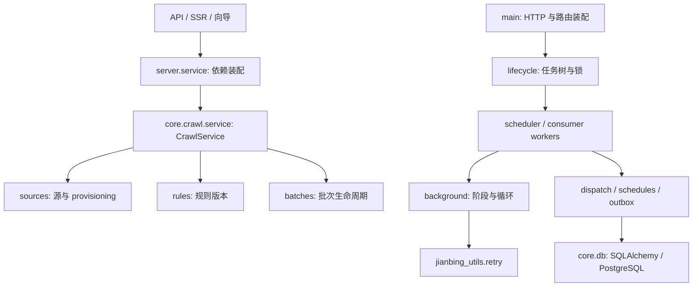

# 架构重构与边界

日期：2026-10-04。结论：保留当前单主控、三库和独立 Agent 的部署形态，通过职责模块、显式应用服务和统一后台执行器降低耦合。

## 问题与修复

| 优先级 | 原问题 | 修复 | 回归风险 |
|---|---|---|---|
| P1 | `crawl/run.py` 的 1,612 行混合数据源、批次、节点、队列、结果和调度 | 9 个职责模块；原文件仅保留 44 个公开入口的兼容 facade | 中：采集链路关键，但拆分阶段全部定义通过 AST 等价检查 |
| P1 | 建源业务编排放在 server，隐式获取引擎 | `CrawlService(pyp, data_center)` 负责业务；API、SSR 和向导通过 FastAPI dependency 注入 | 中：须保持授权与双通道 provisioning 顺序 |
| P1 | 派发、推送各自实现循环、退避和心跳，难以脱离 app 测试 | 独立 worker + `PeriodicStage`、`run_stages`、`run_periodic` | 中：阶段隔离、低频调度、失败恢复及取消均有行为测试 |
| P1 | 取消期间释放资源可能被打断，后台任务未退出就释放锁 | `lifecycle` 先等待任务树退出，再在 shield 中解锁并释放所有连接池 | 中：故障场景以模拟连接验证，真实 PG 锁仍需集成验收 |
| P2 | readiness 短缓存放在模块全局，可串到不同 app | 缓存归当前 app，lifespan 重启时清空 | 低：新增实例隔离和重启测试 |
| P2 | 退避公式在工具库、采集和后台循环重复 | 统一消费 `jianbing_utils.retry.backoff_delay` | 低：保留原有后台封顶与采集 Retry-After 策略 |

## 依赖与职责



| 模块 | 唯一职责 |
|---|---|
| `_policy` | 授权记录校验、URL 指纹、域名边界、fencing 判定；无 I/O |
| `sources` | 数据源创建、访问复核、限流信息、整源暂停、动态表 provisioning |
| `batches` | 批次创建、进度、收尾、取消和重跑 |
| `nodes` | 一次性入网、长期凭证、注册、心跳、离线 |
| `dispatch` | 公平扫描、能力过滤、ACK 与执行租约、失联回收 |
| `results` | 入库上下文、迟到回报校验、结果提交与请求终态 |
| `frontier` | 续爬请求派生、深度限制和批内 URL 去重 |
| `resilience` | 重试预算、Retry-After、请求退避和源级冷却 |
| `schedules` | 到期调度扫描、原子认领、推进和停用 |
| `service` | 跨职责编排；显式接收引擎，不读取全局配置、不启动后台循环 |
| `run` | 旧公开入口的兼容导出；生产代码不得依赖它 |

`results → frontier → _policy` 保持单向；数据源、批次、节点、派发、韧性和调度模块互不导入。
原有 `server → core → contracts`、`agent → contracts` 方向继续由 import-linter 验证，共 7 条 contract。
SQLAlchemy 模型继续属于 core，contracts 不承担数据库或应用服务职责。

## 方案选择

| 方案 | 原理及收益 | 缺点 / 风险 | 成本 | 适用场景 | 结论 |
|---|---|---|---|---|---|
| 职责模块 + 应用服务 | 在现有进程内建立可检查的边界，显式传入依赖，兼容旧入口 | 路由中的其余管理查询仍可继续收敛，尚未把所有 ORM 访问隐藏在 Repository 后 | 中 | 当前单主控与三库架构 | 本次采用 |
| 全面 Repository / Unit of Work | 将所有持久化统一抽象，便于切换数据库和应用入口 | 大量 SQL 迁移与事务语义重写；三库仍无法获得原子事务 | 高 | 确有多个持久化后端或复杂领域变化时 | 当前收益不足 |
| 拆为微服务 | 通过进程和网络建立部署边界，独立扩容 | 新增协议、重试、鉴权、监控和跨服务一致性成本，现有 Hub/限流状态需要重新设计 | 很高 | 明确需要独立扩容与团队自治时 | 当前不采用 |

## 兼容与行为变化

- 旧 `payipa.crawl.run` 的 44 个公开符号、核心调用签名与返回值保持可用。拆分阶段 60 个定义 AST 全部等价；随后仅 `_retry_delay` 的公式改为公共退避函数调用，返回策略保持一致。
- HTTP 路径、请求/响应 schema、契约版本、数据库 schema 和 Alembic revision 保持原有定义。
- 三库边界与“先落幂等数据，再更新成功状态”、attempt fencing、授权拒绝暂停、prod/test 物理隔离继续保持。
- dispatch/push 间隔必须为有限正数；GC 间隔允许零和负数关闭，但拒绝 NaN/Infinity。非法配置在启动前报错。
- `jianbing_utils` 的退避参数拒绝负数/非有限数，重试预算必须为正整数，取消即使在 `(BaseException,)` 过滤下也立即传播。分片计数对负对象大小改为显式 `ValueError`。详见工具库的 `docs/architecture.md`。
- S3 网络接口仍为 `NotImplementedError`，没有新增后端或生产部署能力。

## 验证与运行

常规质量检查沿用 CI 的 Ruff、import-linter、pytest 和包构建。联合验证兄弟目录源码时，无需修改 git tag 源或 lock：

```bash
# payipa 根目录；使用安装了工作区依赖的 Python
uv run --no-sync python scripts/verify_sibling_utils.py
```

脚本在独立进程中分别运行工具库与主项目测试，仅对子进程设置 `PYTHONPATH`。
正式依赖继续锁定现有 `jianbing-utils v0.1.3`；主项目只使用该版本已有的函数入口，因此旧版本与本地新源码均可运行。
工具库后续发版时，仍按双仓纪律更新 tag 和 lock，不把本地 path 源写进提交。

本次本地验证：使用独立临时 PostgreSQL 三库和 Linux Docker 运行时，payipa 277 passed / 1 skipped；工具库在 Python 3.11 与 3.14 下各 59 passed；7 条导入边界通过；四个工作区包与工具库的 sdist/wheel 离线构建通过。
仅跳过当前 Windows 主机不可创建 symlink 的用例。主控、普通 Agent 和浏览器 Agent 镜像均构建成功，浏览器镜像内 Chromium 可启动；Compose 健康检查和三库迁移冒烟通过。真实 Agent 入网及外部数据源采集仍须单独验收。

## 回滚

本次不含 schema migration。回滚应整体撤销本次代码、测试和依赖 metadata 变更，包括新模块；恢复后执行 `uv sync --locked` 并重启主控。
对仍在执行的采集批次，先优雅停止服务再替换代码，继续沿用原有租约回收逻辑。
若回滚前已加入新的修改，应先保存它们并检查反向 patch 能否应用，避免混合撤销。工作区 `refactor-review/README.md` 提供生成的两个反向检查通过的 patch 和具体命令。

后续数据库集成验收继续使用隔离测试三库，运行现有 Alembic 与全量 pytest；生产运行形态依然是单主控、单 worker。
